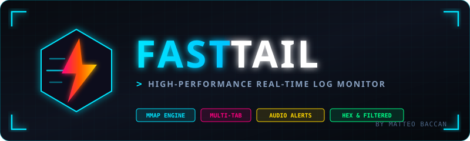
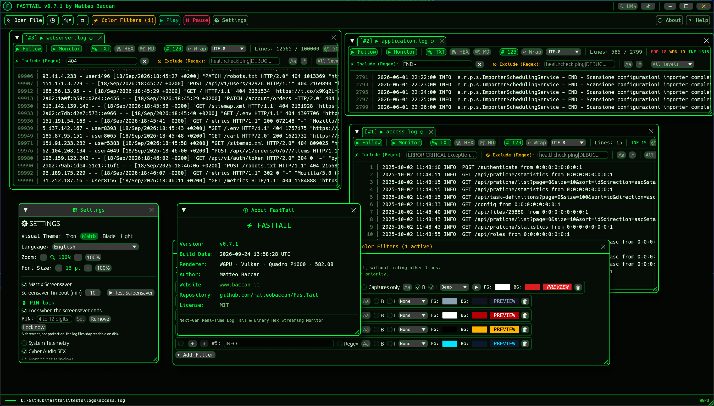

<div align="center">
  

  <p><strong>Next-generation ultra-fast multi-stream log monitor & tail viewer with Cyberpunk UI aesthetic.</strong></p>

  <p>
    <a href="https://github.com/matteobaccan/FastTail/actions/workflows/build.yml"></a>
    <a href="LICENSE"></a>
    <a href="https://www.rust-lang.org/"></a>
    <a href="https://github.com/matteobaccan/FastTail/releases"></a>
  </p>

  <p>
    
  </p>
</div>

---

## ⚡ Overview

**FastTail** is a modern, high-performance cross-platform log tailing application written in Rust. Designed as the successor to legacy tools like BareTail, it combines a **zero-lag 64-bit streaming engine** with a **Cyberpunk UI**, rich log intelligence, audio alert presets and a modular docking workspace.

Whether you are monitoring multi-gigabyte production logs, inspecting raw binary streams in Hex mode, reading Markdown or HTML reports, or isolating errors with priority-ordered highlight rules, FastTail stays instantly responsive with a minimal memory footprint.

---

## 🚀 Feature Highlights

- **Zero-Lag Streaming Engine**: never holds the file in memory. Rows are read on demand through a 4 MB block cache per stream; the only per-file state is the line index (8 bytes per line). Appends are indexed incrementally, log rotation, truncation and in-place rewrites are detected without locking the file for the writer, and files above 16 MB run filters and search on a worker thread with progress shown in the stream bar (above 256 MB the initial index too). Ten 50 MB logs growing continuously cost about 60 MB of RAM and a few milliseconds per frame.
- **Named Sessions**: save the open streams, filters, layout and bookmarks under a name and switch between projects in one click; session files keep relative paths so a log bundle can move with its session.
- **Three View Modes per Stream**:
  - **TXT**: virtualized text view with highlight rules, inline JSON pretty-printing and stack-trace grouping.
  - **HEX**: live hexadecimal + ASCII dump with byte columns in multiples of 8 (16, 24, 32...).
  - **MD**: rendered Markdown. `.md` files open in this mode automatically and HTML documents are converted to Markdown on the fly.
- **Powerful Search**: a search box per stream, `F3` / `Shift+F3` navigation scoped to the focused window, match counter, wrap-around beep, last 10 queries history, matches refreshed live as the file grows. In HEX mode the query is matched at byte level (text or `0A 0D` patterns), and a marker column (`▶` current hit, `●` other hits) plus full-row highlight is shown in every view.
- **Live Include / Exclude Filters**: plain text or regex, case-sensitive or not, applied as you type. Filtered rows are virtualized so the viewport is always full.
- **Multi-Rule Highlighting**: foreground, background, **bold**, *italic*, top-down priority (reorder with ⬆ / ⬇), and a sound alert preset per rule (Beep, Chime, Warning, Critical).
- **Capture-Group Highlighting and Quick Labels**: a regex rule can paint only its capture groups (`req=(\d+)` colours the request id, not the row) with "Captures only"; the first rule wins per byte, top-down, and at most 64 spans are painted per row. `Ctrl+Shift+1..9` turns the current search text into a quick colour label with preset colour 1..9, painted in every stream and listed in a strip above the rows with a remove button; labels rank below the rules and are not saved across restarts.
- **Cyberpunk Themes**: **Tron** (obsidian & neon cyan), **Matrix** (phosphor green), **Blade** (charcoal & amber/magenta) and a clean **Light** theme.
- **Modular Docking Workspace** (egui_dock): dock, split, float or tab any number of streams. Layout, floating window positions, dialog positions and window geometry are persisted and restored.
- **Multi-Encoding Support**: automatic detection and manual override for ASCII, ANSI (Windows-1252), UTF-8 (with/without BOM), UTF-16 LE and UTF-16 BE.
- **Log Intelligence**: inline `[+] JSON` detection with pretty-printing, multiline stack-trace continuation kept together with its parent line.
- **Log Level Detection**: the level of every line (`FATAL`, `ERROR`, `WARN`, `INFO`, `DEBUG`, `TRACE`, plus syslog `<n>` priorities) is detected from the common layouts without configuration. Rows are coloured by level when no highlight rule matches them (switchable in Settings), a `≥ level` selector above the buffer filters by minimum level together with the include / exclude filters, and the stream bar counts the lines per level live.
- **Directory Wildcard Tail**: open `C:\logspp-*.log` (type it in the `📂*` prompt, drop a folder on the window, or pass it on the command line) and the stream follows the newest file matching the pattern, switching by itself when the logger rotates to a new day or hour. Filters, highlight rules, search and wrap survive the switch; the stream bar shows the pattern, the current file and a "switched to" notice. The pattern, not the resolved file, is what the workspace and the recent list remember.
- **External Tools**: configurable commands run on a row from the right-click menu, the stream menu or a shortcut (`code -g "{file}:{lineno}"`, `ssh {match}`), with the placeholders `{line}`, `{file}`, `{dir}`, `{lineno}`, `{selection}` and `{match}` (first capture of the tool's own regex). A tool can be bound to a highlight rule and runs when the rule matches an appended line, at most once per second and with at most 10 children at a time. Arguments reach the program as separate argv entries, never through a shell, unless "run via shell" is deliberately switched on.
- **Line Wrap**: a per-stream `↩ Wrap` toggle (`Alt+W`) soft-wraps long lines (JSON payloads, stack traces, URLs) at the window width instead of scrolling horizontally. Wrapped rows keep their line number, marker and colours; search, bookmarks, go-to and paging still navigate by line. Only the rows in view are laid out, so wrapping stays cheap on huge files; the scroll bar thumb is approximate in wrap mode. The toggle is saved per file.
- **Telemetry & FX**: CPU and memory in the title bar, per-stream throughput, optional borderless window, Matrix digital rain screensaver after a configurable idle time (10 minutes by default).
- **BareTail Migration Bridge**: one-click import of recent files and highlight colors from BareTail / BareTailPro on Windows.
- **Multilingual UI**: 16 languages — English, German, Spanish, French, Italian, Dutch, Polish, Portuguese (Brazil), Turkish, Russian, Ukrainian, Japanese, Korean, Chinese (simplified and traditional) and Friulian — picked automatically from the system locale and switchable in Settings (the first entry of the picker, "System language", keeps following the OS), with CJK font fallback for Chinese, Japanese and Korean.
- **Crash Logger**: an unexpected panic writes `fasttail_crash.log` with version, commit and build timestamp so it can be reported.

---

## 📊 Comparison with Other Tail Tools

| Feature | FastTail | BareTail (Free/Pro) | Tailviewer | SnakeTail | `tail -f` / CLI |
| :--- | :---: | :---: | :---: | :---: | :---: |
| **Engine / Architecture** | **Rust** | Win32 C++ (2006) | .NET / C# | C# / WPF | POSIX C |
| **Binary Size** | **~10 MB (single binary)** | ~220 KB | ~45 MB | ~1.5 MB | ~50 KB |
| **Runtime Dependencies** | **Zero (standalone native)** | Zero (Win32 native) | .NET Runtime required | .NET Framework / WPF | POSIX coreutils |
| **Large Files (>50 GB)** | **Instant** | Good | Slow / High RAM | Moderate | Fast |
| **Cross-Platform** | **Windows, Linux, macOS** | Windows only | Windows only | Windows only | Linux/macOS |
| **User Interface** | **Cyberpunk UI (GPU)** | Win32 Classic | Modern Windows | Classic Windows | Terminal CLI |
| **Multi-Tab / Docking** | **Full modular docking** | Tabs only | Tabs & Panels | Tabs & Splits | Multiple terms |
| **Binary Hex View** | **Yes, with byte-level search** | No | Plugin required | No | No (`xxd`) |
| **Markdown / HTML View** | **Yes** | No | No | No | No |
| **Line Wrap** | **Per stream (`Alt+W`), navigation by line kept** | Yes | No | No | Terminal wrap |
| **Directory Wildcard Tail** | **`app-*.log` follows the newest match, switch keeps filters** | No | No | Yes | `tail -F` one file |
| **Include / Exclude Filters** | **Live, text or regex** | Pro version only | Yes | Yes | `grep` pipe |
| **Log Level Detection** | **Built-in: colouring, `≥ level` filter, counters** | No | Yes | No | N/A |
| **Highlighting Styles** | **FG, BG, Bold, Italic** | FG, BG | FG, BG | FG, BG | ANSI codes |
| **Capture-Group Highlight / Quick Labels** | **Captures-only rules, `Ctrl+Shift+1..9` labels** | No | No | No | No |
| **Rule Priority Reordering**| **Yes (⬆ / ⬇ top-down)** | Limited | Yes | Yes | N/A |
| **External Tools** | **Placeholders, shortcuts, rule-bound runs, no shell by default** | No | No | Yes | Pipes |
| **Sound Alerts** | **Presets (Beep/Chime/Crit)** | No | Plugins | Limited | Bell (`\a`) |
| **Encoding Support** | **ASCII, ANSI, UTF-8, UTF-16 LE/BE** | ANSI, UTF-8, Unicode | UTF-8, ANSI | UTF-8, ANSI | Terminal enc |
| **JSON Formatter** | **Inline pretty-print** | No | Plugin required | No | `jq` pipe |
| **Screensaver Mode** | **Matrix digital rain** | No | No | No | No |
| **Open Source & License** | **MIT License** | Proprietary | MIT | GPL | Open Source |

---

## ⌨️ Keyboard Shortcuts Reference

Search and navigation shortcuts act on the stream in the **focused dock panel** (click a panel to focus it).

| Shortcut | Description |
| :--- | :--- |
| `Space` | Toggle Follow mode (auto-scroll to the latest line) |
| `Ctrl + F` | Focus the search box of the focused stream |
| `F3` / `Shift + F3` | Next / previous search match in the focused stream |
| `Enter` / `Shift + Enter` | Next / previous match while typing in the search box |
| `↑` / `↓` / `←` / `→` | Scroll by one line / column (`Ctrl` + `←` / `→` scrolls 5x faster) |
| `PgUp` / `PgDown` | Scroll by one page |
| `Home` / `End` | Scroll horizontally to the far left / right |
| `Ctrl + Home` | Jump to the top of the file and pause follow |
| `Ctrl + End` | Jump to the latest line and resume follow |
| `Click` / `Shift + Click` / `Ctrl + Click` | Select a row / extend the selection over the visible rows / toggle a row |
| `Ctrl + A` | Select every visible row of the focused stream |
| `Ctrl + C` | Copy the selected rows (or the current search hit) as plain text |
| `Ctrl + G` | Go to line N, or `+N` / `-N` from the current line (hidden lines resolve to the next visible one) |
| `Ctrl + Shift + T` | Toggle always-on-top (also the 📌 pin in the title bar and a Settings checkbox) |
| `Ctrl + L` | Lock the window behind the PIN (needs a PIN set in Settings → PIN lock) |
| `Ctrl + F2` / `F2` / `Shift + F2` | Bookmark the current row (`★` in the marker column) / jump to the next / previous bookmark, wrapping around; bookmarks are saved per file |
| `Alt + W` | Toggle line wrap for the focused stream (also the `↩ Wrap` button in the stream bar); saved per file |
| `Ctrl + Shift + 1..9` | Create, recolour or remove the quick colour label (preset 1..9) for the current search text of the focused stream; labels apply to every stream and are listed above the rows |
| `Alt + 1..9` | Switch to stream tab #1 through #9 |
| `Ctrl +` / `Ctrl =` | Zoom the interface in (+10%) |
| `Ctrl -` | Zoom the interface out (-10%) |
| `Ctrl 0` | Reset the zoom to 100% |
| `Ctrl + MouseWheel` | Smooth zoom with the wheel |

Zoom scales the whole interface, log text included, and is shown as a percentage in the title bar next to the always-on-top pin (dim at 100%, accent colour when zoomed; click it to go back to 100%). Settings → Zoom has the same control, and the value is saved in `fasttail.ini` (`zoom_factor`), so the window reopens at the scale you left it. The separate **Font size** setting sets the log text in points, independently of the zoom.
| `F1` | Open the Help & Keyboard Shortcuts dialog |
| `Esc` | Close the active dialog, or leave the search box |

Files can also be opened by **drag & drop** onto the window or from the command line:

```text
fasttail [OPTIONS] [PATH...]

  PATH...            log files to open in addition to the restored workspace
  --fresh            start with an empty workspace instead of the saved one
  --filter <TEXT>    include filter for the files opened from the command line
  --exclude <TEXT>   exclude filter for those files
  --follow / --no-follow
                     follow mode for those files
  --renderer <NAME>  auto (default), glow, wgpu or software
  --config <FILE>    configuration file to use (same as FASTTAIL_CONFIG)
  -V, --version      print the version and exit
  -h, --help         print the usage and exit
```

Example: `fasttail --fresh --filter ERROR app.log err.log`.

---

## ⚙️ Configuration

Settings are stored in a single `fasttail.ini` file, looked up in this order:

1. the path in the `FASTTAIL_CONFIG` environment variable, if set;
2. `fasttail.ini` in the current working directory (portable layout);
3. `fasttail.ini` next to the executable;
4. the per-user directory: `%APPDATA%\FastTail` on Windows, `$XDG_CONFIG_HOME/FastTail` or `~/.config/FastTail` elsewhere.

New installs write next to the executable and fall back to the per-user directory when that folder is read-only (for example `Program Files`). A legacy `fasttail.toml` from older versions is migrated automatically on first start.

### Sessions
The 🗂 button in the title bar saves the workspace under a name and loads it back. A session file (`name.fasttail-session.ini`) holds the open files and patterns, the dock layout, and for every stream its include/exclude filters, search query, line wrap, encoding and bookmarks; theme, language, highlight rules and the other preferences stay in `fasttail.ini`. Loading a session replaces the current streams; if the current named session has unsaved changes (a `*` after its name in the title bar) FastTail asks first. Files that no longer exist are listed and skipped.

Paths are written absolute and, when the file lies under the session's folder, also relative to it: a session saved next to a log bundle still opens after the bundle is moved or copied elsewhere. "Save current as default workspace" writes the workspace back into `fasttail.ini` and leaves the named session. `fasttail --session incident.fasttail-session.ini` loads a session at startup.

### External tools
What they are for, with ready-made recipes (open the row in an editor, SSH to the host in the line, pretty-print its JSON, alert on a rule): **[External tools cookbook](docs/external-tools-cookbook.md)**.

Settings → External tools. Each tool has a name, a program, an argument list and optional extras. The arguments are split like a command line (quotes group words) and every entry is expanded and passed to the program as its own argv element, so a log line containing `; rm -rf /` is only text.

| Placeholder | Value |
|---|---|
| `{line}` | text of the row |
| `{file}` | path of the file being tailed (the resolved file of a pattern stream) |
| `{dir}` | its directory |
| `{lineno}` | 1-based line number |
| `{selection}` | the selected rows as text, or the row itself |
| `{match}` | first capture group of the tool's own regex applied to the row (the whole match without a group, empty when it does not match) |

Extras: a **shortcut** such as `Ctrl+Shift+F9` (a modifier is required) runs the tool on the current row of the focused stream; **run on rule** binds the tool to a highlight rule, so it runs when the rule matches an appended line, at most once per second per tool and with at most 10 children running at the same time, the excess being counted as dropped runs in the settings row. **Run via shell** hands the program and the expanded arguments to `cmd /c` (Windows) or `sh -c` as one command line: the shell then parses the row text, so keep it off unless the log is trusted. Tools are stored as `[tool.N]` sections of `fasttail.ini`.

### PIN lock
Settings → PIN lock. Set a PIN of 4 to 12 digits and the window can be locked behind it: with **Lock when the screensaver ends** on, coming back from the Matrix screensaver asks for the PIN, and `Ctrl+L` (or the **Lock now** button) locks on demand. While locked, an opaque animated backdrop covers the window and every keyboard shortcut is ignored — `Esc` included — while the streams keep tailing behind it, so nothing is missed. `Enter` confirms the PIN, and three wrong PINs in a row replace the entry field with a one-minute countdown.

The PIN is scrambled before it is written to `fasttail.ini` (`lock_pin`), so it is not readable at a glance. That is the extent of it: **the lock is a deterrent against someone walking past the screen, not a security boundary.** The log files stay readable on disk, the config file can be edited, and a maintenance unlock phrase opens the prompt whatever the PIN is. Do not use it to protect sensitive logs — use the operating system's screen lock and file permissions for that.

### Rendering backend
FastTail starts on `wgpu` (Direct3D 12 or Vulkan on Windows, Vulkan on Linux, Metal on macOS) and, if that backend cannot be created, retries automatically with OpenGL. Both backends run without vsync because many drivers (NVIDIA on Windows among them) busy-wait for the vertical blank and burn CPU cores whenever egui repaints; running without vsync and with paced rendering keeps continuous repaints lightweight. The status bar shows which backend is active: `WGPU`, `GL`, or `GL fallback` when the retry happened; hover it, or open About, for the adapter details.

A `software` renderer is also available as a last-resort fallback for machines with no usable GPU (or for troubleshooting driver problems). It forces the wgpu CPU rasterizer (WARP on Windows, llvmpipe on Linux). **This mode is not optimized and is CPU-hungry: WARP is designed to spread rasterization across every logical core, so the process keeps several cores busy even when the log is idle and the window is unfocused.** The cost only drops when the window is minimized. On a machine with a working GPU use `auto` (the default), `wgpu` or `glow` instead; software mode only makes sense when no hardware backend can start. A banner reminds you while the software renderer is active.

| Setting | Values | Where |
|---|---|---|
| `renderer` in `fasttail.ini` | `auto` (default), `glow`, `wgpu`, `software` | Settings dialog, applies at the next start |
| `FASTTAIL_RENDERER` | same values, overrides the config | environment, useful for support: `FASTTAIL_RENDERER=wgpu fasttail` |

When the first backend fails, the error is printed to stderr together with `renderer: falling back to OpenGL`.

---

## 🛠️ Building & Installation

### Prerequisites
- [Rust](https://rustup.rs/) 1.87 or newer
- On Linux: `libasound2-dev libudev-dev pkg-config libx11-dev libxcb1-dev libxcursor-dev libxrandr-dev libxi-dev libxkbcommon-dev libwayland-dev`

### Build from Source
```bash
git clone https://github.com/matteobaccan/FastTail.git
cd FastTail

# Run development build (optionally with files to open)
cargo run -- app.log other.log

# Run the test suite
cargo test

# Build optimized release binary
cargo build --release
```

The standalone executable is written to `target/release/fasttail` (`target/release/fasttail.exe` on Windows).

### Benchmarks
`cargo bench` runs `benches/filter_bench.rs`, which times the engine hot paths (indexing, include/exclude and regex filters, search, highlight scanning) on a synthetic 200 MB log generated in a temporary directory. It is built only on demand, never by `cargo test`.

| Variable | Effect |
|---|---|
| `FASTTAIL_BENCH_LOG=<file>` | benchmark an existing log instead of generating one |
| `FASTTAIL_BENCH_BYTES=<n>` | size of the generated log (default 200000000; 1100000000 was used for the LTO decision) |
| `FASTTAIL_BENCH_ROUNDS=<n>` | rounds per phase, best time reported (default 3) |

### Prebuilt binaries
Tagged versions are published on the [Releases](https://github.com/matteobaccan/FastTail/releases) page as one archive per platform:

| Platform | Asset | Contents |
|---|---|---|
| Windows x86_64 | `fasttail-windows-x86_64.zip` | `fasttail.exe` + `fasttail.pdb` |
| Linux x86_64 | `fasttail-linux-x86_64.tar.gz` | `fasttail` |
| Linux ARM64 | `fasttail-linux-arm64.tar.gz` | `fasttail` |
| macOS Apple Silicon | `fasttail-macos-arm64.tar.gz` | `fasttail` |

```bash
# Linux / macOS
tar -xzf fasttail-linux-x86_64.tar.gz && ./fasttail app.log

# Windows (PowerShell)
Expand-Archive fasttail-windows-x86_64.zip -DestinationPath fasttail; .\fasttail\fasttail.exe app.log
```

Keep `fasttail.pdb` next to `fasttail.exe`: it lets a crash report (`fasttail_crash.log`) show function names. Every push and pull request runs the test suite in [GitHub Actions](https://github.com/matteobaccan/FastTail/actions); release binaries are built only for `v*` tags and manual workflow runs.

---

## 📐 Specifications

Behaviour is documented as [OpenSpec](https://github.com/Fission-AI/OpenSpec) specifications under [`openspec/specs`](openspec/specs): stream engine, search and navigation, filters and highlighting, docking UI, themes, localization, log intelligence, screensaver, telemetry, BareTail migration, crash reporting, the release pipeline, the rendering backend, the command line, selection and export.

---

## 📄 License

This project is licensed under the **MIT License** - see the [LICENSE](LICENSE) file for details.

Copyright (c) 2026 **Matteo Baccan**
