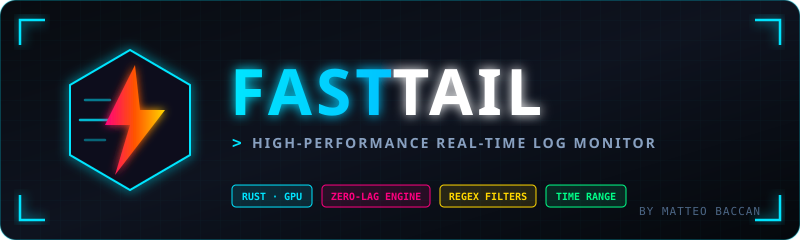
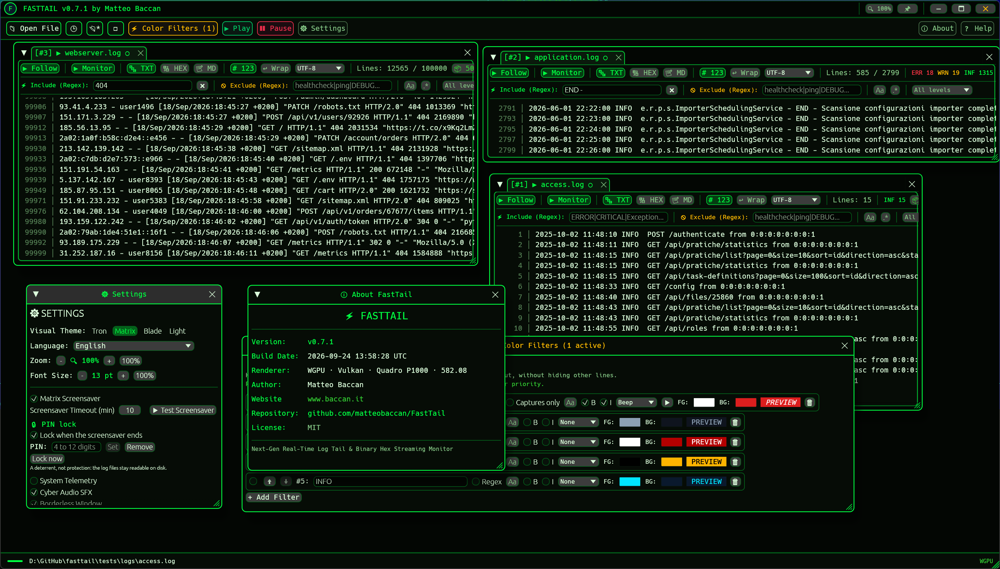

<div align="center">
  

  <p><strong>Next-generation ultra-fast multi-stream log monitor & tail viewer with Cyberpunk UI aesthetic.</strong></p>

  <p>
    <a href="https://github.com/matteobaccan/FastTail/actions/workflows/build.yml"></a>
    <a href="LICENSE"></a>
    <a href="https://www.rust-lang.org/"></a>
    <a href="https://github.com/matteobaccan/FastTail/releases"></a>
  </p>

  <p>
    
  </p>
</div>

---

## ⚡ Overview

**FastTail** is a modern, high-performance cross-platform log tailing application written in Rust. Designed as the successor to legacy tools like BareTail, it combines a **zero-lag 64-bit streaming engine** with a **Cyberpunk UI**, rich log intelligence, audio alert presets and a modular docking workspace.

Whether you are monitoring multi-gigabyte production logs, inspecting raw binary streams in Hex mode, reading Markdown or HTML reports, or isolating errors with priority-ordered highlight rules, FastTail stays instantly responsive with a minimal memory footprint.

---

## 🚀 Feature Highlights

- **Zero-Lag Streaming Engine**: never holds the file in memory. Rows are read on demand through a 4 MB block cache per stream; the per-file state is the line index (8 bytes per line) plus, once scanned, a level byte and a timestamp per line and the search hits (at most 1,000,000, 8 MB). Appends are indexed incrementally, log rotation, truncation and in-place rewrites are detected without locking the file for the writer, and files above 16 MB run filters, search and the timestamp scan of the time range on a worker thread with progress shown in the stream bar (above 256 MB the initial index too). Ten 50 MB logs growing continuously cost about 60 MB of RAM and a few milliseconds per frame.
- **Named Sessions**: save the open streams, filters, layout and bookmarks under a name and switch between projects in one click; session files keep relative paths so a log bundle can move with its session.
- **Three View Modes per Stream**:
  - **TXT**: virtualized text view with highlight rules, inline JSON pretty-printing and stack-trace grouping.
  - **HEX**: live hexadecimal + ASCII dump with byte columns in multiples of 8 (16, 24, 32...).
  - **MD**: rendered Markdown. `.md` files open in this mode automatically and HTML documents are converted to Markdown on the fly.
- **Powerful Search**: a search box per stream, `F3` / `Shift+F3` navigation scoped to the focused window, match counter, wrap-around beep, last 10 queries history, matches refreshed live as the file grows. In HEX mode the query is matched at byte level (text or `0A 0D` patterns), and a marker column (`▶` current hit, `●` other hits) plus full-row highlight is shown in every view. The `☰` button opens a **search results pane** under the rows listing only the matching lines (line number, text, query tinted), virtualized so a million hits cost what ten do; a click or `Enter` makes a hit current and centres it in the main view. Up to 1,000,000 hits are listed per stream; past that the search keeps counting and the counter shows the true total with a "first 1,000,000 listed" note.
- **Search in a Range**: the `⌖` chip beside the search box limits the search to part of the view without hiding the rest: **Selection** (from the first to the last selected line), **Lines** typed as shown (`1200-5000`, `1200-` to the end and growing with the file, `-5000` from the start) or **Time** (a from / to pair typed as in the time range popup, `to` up to the end of the unit typed; the stream is timed first, with `⏳` meanwhile). The row menu offers **Search in selection**, **Search from here** and **Search up to here**. Only the visible lines inside the scope are hits: the counter reads `[3 / 17 in range]`, `F3` / `Shift+F3` wrap inside it, the results pane and the timeline's search lane list only those hits, and the overview strip shades a line scope. `✖` beside the chip returns to the whole view; a truncation, rotation or reload does too, and says so. A small line scope of a huge file is searched on the spot, whatever the file size. The scope is not saved. The Find results tab has optional **from / to** time fields that limit every stream to that time span, read on each stream's own clock (streams without usable timestamps are listed as skipped).
- **Tray icon (Windows)**: Settings → **Tray icon** puts FastTail in the notification area (off by default). A click on the icon shows or hides the window, a double click shows it; its menu shows / hides the window, follows or pauses every stream, mutes sounds, lists the open streams (a click shows the window on that stream) and quits. **Minimise to tray** sends the window there instead of the taskbar (FastTail's own minimise button, and best effort for the system one), and **Close to tray** makes the close button hide it; `Ctrl + Q` or **Quit** in the menu quits for real. While hidden, the streams keep being followed and rules, sounds and automatic bookmarks keep running; a red dot on the icon marks alerts sounded while the window was hidden or in the background, and the tooltip counts them (`FastTail — 3 streams · 12 alerts`). Showing and focusing the window clears it. Saved as `tray_icon`, `minimize_to_tray` and `close_to_tray` in `[general]`. Linux and macOS: not yet (the options are greyed out).
- **Structured logs (field parser)**: a chip in the stream bar (Text view) shows how the lines' fields are read: `{} JSON` and `k=v logfmt` are detected from the first 200 lines (again once when a short stream reaches 200 lines; JSON also after a leading timestamp), `ƒ —` when the log is plain text. Its menu forces JSON, logfmt, **Apache** / NGINX combined, **syslog** (RFC 3164), a **regular expression** with named groups (`(?P<level>[A-Z]+) (?P<msg>.*)`, red while invalid) or off. The choice is saved per stream (`fields_parser=`, `fields_regex=`). **▦ Columns** then shows the fields as columns: the first 8 keys by default (nested JSON as `http.status`), then a message column (`msg` / `message`, followed by the fields not shown as `key=value`). Drag a column name to move it and its right edge to resize it; right-click the header to hide, move or pick the fields shown, or reset. Level fields are coloured by level; lines that do not parse run across the columns, dimmed. Saved as `fields_view`, `fields_columns` and `fields_width.<key>`. Field filter terms (`level=error`, `status>=500`) and the level and time read from the fields are planned for 0.21.0, after the terminal interface of 0.20.0.
- **Compare lines**: the row menu's **⇄ Compare** offers *Compare the two selected lines* (exactly two rows selected), *Mark the selection for compare*, and *Compare the selection with …* the marked lines (another stream, or another part of the same one). A **⇄ Compare** tab (not saved) shows both sides next to each other: for two lines the tokens that differ are highlighted; for regions (up to 20,000 lines a side) the rows are aligned as equal, changed (with the differing tokens highlighted), removed or added, with the number of changes, `F7` / `Shift + F7` (or ▲ ▼) to walk them, and a double-click on a row shows that line in its stream. **Ignore** toggles drop what should not count before comparing: the leading timestamp (on by default), numbers, hex ids and UUIDs, the amount of whitespace, case; **as JSON** (two lines holding JSON) pretty-prints both with sorted keys, so a changed field is one changed row. **Copy as unified diff** puts `diff -u` text on the clipboard.
- **Filter as a new tab**: with a filter set on a stream (include / exclude terms, minimum level or time range), **⧉ Open filter as new tab** in its 💾 menu or row menu opens a tab `⧉ app.log ▸ ERROR` next to it holding the lines that pass that filter **as it is now** (the filter is frozen: changing the source's filter afterwards leaves the tab alone). The tab keeps following the source (new matching lines are appended; a truncation or rotation of the source rebuilds it), and it is a normal stream: its own search and filters to narrow further, highlight rules, collapse, bookmarks, copy, export, and another filter tab from it. The gutter and go to line use the **source's line numbers**; **Show in context** / `Ctrl + K` on a row shows that line in the source stream (reopened if it was closed). The tab's tooltip gives the source and the frozen filter. Closing the source stops the tab from following (its stream bar says so); the matched lines are kept in a spool bounded by `stdin_spool_max_mb`, and the tab stops following when it is full. Like standard input, a filter tab is not saved with the workspace or sessions.
- **Scratchpad**: **🗒 Scratchpad** in the 🗂 menu (or the command palette) opens a plain-text tab, one per session, to collect the lines that matter and write around them. **Send to scratchpad** in the row menu or `Ctrl + Shift + N` appends the selected rows of the stream (every line of a collapsed group, as copy does) under a reference line `── app.log:1204 ──`; "Send without reference line" skips it, and a Find results hit has the same menu entry. The reference is plain text: `Ctrl + click` (or `Alt + Enter`) on it shows that line in its stream like **Show in context**, opening the file again when it was closed (its path is remembered beside the pad). The tab has a find box, **Save as…** and **Clear** (confirmed); the pad is capped at 4 MB. It is saved beside the session as `name.fasttail-session.scratch.txt` (for the default workspace `scratchpad.txt` beside `fasttail.ini`), a second after each change and on exit, and switches with the session.
- **Search All Streams**: `Ctrl+Shift+F` (or the `🔎` button next to a stream's search box) opens a **Find results** tab with the focused stream's query; `Enter` searches every open stream with the same case-insensitive match as the per-stream search, over the lines each stream shows under its own include/exclude, level and time filters and the global filter (ANSI codes stripped where the stream strips them; streams in HEX view are skipped). Each stream is searched by its own background job, independent of the stream's own scans, at most four at a time (fewer on smaller machines), the others queued. The results are grouped by stream (name, match count, progress, collapsible) in one virtualized list; a click or `Enter` brings that stream's tab to the front, centres the line and pauses follow without touching the stream's own search, and the list keeps the keyboard so the arrows, `Page Up` / `Page Down` and `Home` / `End` walk the results with the stream following. Up to 100,000 hits are listed per stream, with the true total counted. Results are a snapshot: Refresh runs the query again, Stop or closing the tab cancels it, and a stream reloaded since (truncated, rotated, rewritten) is marked stale instead of jumping to the wrong line. The tab is not saved in the layout.
- **Command Palette**: `Ctrl+Shift+P` (or `⌨` in the title bar) runs any action or setting by name: follow, wrap, collapse, go to line, export, bookmarks, sessions, the theme or the language... A fuzzy match on the localized and the English name (so `wrap` also finds `Zeilenumbruch umschalten`), each row with its category and shortcut, commands that cannot run now greyed with the reason, and the last 8 commands first.
- **Overview Strip**: a narrow column beside the scroll bar marks where the search hits, the bookmarks and the ERROR/FATAL lines sit among the visible rows, with the viewport drawn as a box; click or drag it to jump there. Hit marks cover the listed hits (the first 1,000,000) and bookmark marks are exact; error marks appear as the level scan reaches the lines and are exact, except on a filtered view of more than 4 million rows, where they are sampled (the tooltip says so). Switchable off in Settings.
- **Live Include / Exclude Filters**: plain text or regex, case-sensitive or not, applied as you type. Filtered rows are virtualized so the viewport is always full. Up to 8 include terms (a line must contain **all** of them) and 8 exclude terms (it must contain **none**) per stream, and named **filter presets** that bring a whole setup back in two clicks, on one stream or all of them. A **global filter** (`CTRL + SHIFT + H` or `🌐`) adds include / exclude terms that every stream, open now or later, applies on top of its own.
- **Multi-Rule Highlighting**: foreground, background, **bold**, *italic*, top-down priority (reorder with ⬆ / ⬇), a sound alert preset per rule (Beep, Chime, Warning, Critical), and **Bookmark matching lines**, which bookmarks every line the rule matches, in the file and as it is appended.
- **Bookmarks with Notes**: `Ctrl + F2` bookmarks a row (`★`), `F2` / `Shift + F2` walk the bookmarks; right-click a row and pick **Bookmark note…** to say why it matters (`✏` in the marker column, the note in its tooltip and in the overview strip). Rules with "Bookmark matching lines" add automatic bookmarks (`☆`, dimmer in the overview strip) that `F2` visits too. Manual bookmarks and their notes are saved per file and in sessions.
- **Capture-Group Highlighting and Quick Labels**: a regex rule can paint only its capture groups (`req=(\d+)` colours the request id, not the row) with "Captures only"; the first rule wins per byte, top-down, and at most 64 spans are painted per row. `Ctrl+Shift+1..9` turns the current search text into a quick colour label with preset colour 1..9, painted in every stream and listed in a strip above the rows with a remove button; labels rank below the rules and are not saved across restarts.
- **Selection Highlight**: double-click a word of a row — a request id, an IP with its port, a UUID, a path — and every exact occurrence of it in the stream is outlined with a thin box, rule colours and search untouched; `Esc`, a double-click on empty space or on the same word clears it. The row menu offers the same on the word under the pointer.
- **Next Line of a Rule**: the row menu's **Next line of rule** lists the highlight rules that match the row; pick one and `F4` / `Shift + F4` walk to the next / previous shown line that rule matches (the next red ERROR, the next slow query), wrapping around with the search beep. Without a picked rule, `F4` uses the first rule matching the selected row. On a large file the walk runs a few milliseconds per frame, with `⏳ seeking rule…` in the stream bar and `Esc` to stop it.
- **Rule Sets**: **Export rules…** / **Import rules…** in the Highlights dialog write and read a `*.fasttail-rules.ini` file with every rule and its options, to hand a tuned set to a colleague; import previews the file and appends (skipping duplicates) or replaces.
- **Automatic Highlighting**: switch it on in Settings and IP addresses (v4 and v6, with ports), UUIDs, URLs, durations (`250ms`, `1.5s`, `2m30s`) and file paths are painted in a colour of the theme per kind, with no rule to write; each kind can be turned off. It ranks below your rules, quick labels and the log's own ANSI colours, above the level colouring.
- **Time Zones**: the `🌐` menu of each stream shows the leading timestamp of every row as written, in UTC, in local time (daylight saving included) or at a fixed offset, and turns epoch seconds and milliseconds into dates; the time span, the time range and the histogram follow. Filters, search, copy and export still see the text as written.
- **ANSI Colour Codes**: container logs (`docker logs`, `kubectl logs`), CI job logs and colourised CLI output show their colours instead of `[32m` fragments. A stream that contains SGR escape sequences switches to **render** by itself (checked on the first 64 KB and on appended data, so colours that start after a banner are caught): 16, 256 and 24-bit colours, bold, dim, italic, underline and inverse are painted with a palette tuned for each theme, below your highlight rules and quick labels and above the level colouring. The `ANSI` selector in the stream bar also offers **strip** (codes hidden, no colour) and **raw** (the codes shown as `␛[31m`), saved per file. In render and strip modes filters, search, rules, level and timestamp detection, copy, export and the `{line}` of external tools all see the text without the codes, so `ESC[31mERROR` is an ERROR line and `\bERROR\b` matches it; HEX still shows the file bytes. A regex written against the codes themselves (`\x1b\[31m`) works in raw mode. A log without escape bytes stays in auto and is read exactly as before.
- **Cyberpunk Themes**: **Tron** (obsidian & neon cyan), **Matrix** (phosphor green), **Blade** (charcoal & amber/magenta), a clean **Light** theme and **Commander**, the classic blue and white of the DOS file managers.
- **Modular Docking Workspace** (egui_dock): dock, split, float or tab any number of streams. Layout, floating window positions, dialog positions and window geometry are persisted and restored.
- **Multi-Encoding Support**: automatic detection and manual override for ASCII, ANSI (Windows-1252), UTF-8 (with/without BOM), UTF-16 LE and UTF-16 BE.
- **Log Intelligence**: inline `[+] JSON` detection with pretty-printing, multiline stack-trace continuation kept together with its parent line.
- **Show in Context**: with a filter active, `Ctrl + K` (or **Show in context** in the row menu) shows the selected line in the full, unfiltered log; `Ctrl + K`, `Esc` or **Back to filtered view** returns to the filtered view as it was, instantly on any file size. The Find results tab offers it too.
- **Context Lines Around Matches**: `grep -C N` in the viewer. The `± N` control in the stream bar (0 to 100, per stream) shows every line the filters keep together with the `N` lines before and after it, the context rows dimmed and a thin rule where lines are hidden (its tooltip says how many). Context lines ignore every filter, as `grep -C` does; changing `N` never refilters, and on a multi-GB file the context appears with the matches as the background scan finds them.
- **Collapse Repeated Lines**: a retry loop, a poller or the same stack trace thrown on every request shows as **one row with a `×N` badge** instead of thousands. The `× Collapse` selector in the stream bar (or `Ctrl + Shift + D`) picks **exact** (the text after the leading timestamp) or **numbers** (numbers, `0x` values, hex ids and UUIDs masked too); consecutive equal entries, stack traces included, become one group over the lines the filters leave visible, and a click on the badge expands it. Copy, export and search still see every line; the mode is saved per stream.
- **Log Level Detection**: the level of every line (`FATAL`, `ERROR`, `WARN`, `INFO`, `DEBUG`, `TRACE`, plus syslog `<n>` priorities) is detected from the common layouts without configuration. Rows are coloured by level when no highlight rule matches them (switchable in Settings), a `≥ level` selector above the buffer filters by minimum level together with the include / exclude filters, and the stream bar counts the lines per level live.
- **Directory Wildcard Tail**: open `C:\logspp-*.log` (type it in the `📂*` prompt, drop a folder on the window, or pass it on the command line) and the stream follows the newest file matching the pattern, switching by itself when the logger rotates to a new day or hour. Filters, highlight rules, search and wrap survive the switch; the stream bar shows the pattern, the current file and a "switched to" notice. The pattern, not the resolved file, is what the workspace and the recent list remember.
- **Compressed Logs**: rotated `app.log.1.gz`, `.bz2`, `.xz` and `.zst` files, `.zip`, `.7z` and `.tar` / `.tar.gz` (`.tgz`) / `.tar.bz2` / `.tar.xz` / `.tar.zst` support bundles open directly, recognised by their content rather than their extension. The archive is decompressed on a background thread into a temporary spool file that the normal engine reads, so filters, search, levels, time range, bookmarks, HEX and export all work and nothing decompressed is held in memory; the first lines appear while the rest is still inflating, with `decompressing N%` and a cancel button in the stream bar. A zip or 7z with several files or any tar opens an entry picker (filter, sort by name or size, multi-select; a tar fills it in while its headers are scanned in the background), each entry in its own stream, and a `.gz` inside a bundle is decompressed once more. A free-space check and a configurable output cap stop runaway archives, and the spool is deleted when the tab closes.
- **Time range**: the span you are looking at, `🕘 14:02:05 → 16:30:12` in the stream bar, is also where the window is set: a click opens a popup with a calendar, time spinners and shortcuts (whole log, first or last day, last hour), applied on OK. Only the lines stamped inside the window stay, with the entry's stack trace travelling with it; `Ctrl+G` takes `14:02` as readily as a line number. Timestamps are read from the line itself (ISO 8601, syslog, Apache/nginx, epoch seconds or millis) with no format to configure; a log FastTail cannot time says so instead of hiding everything. A timeline histogram (`📊`) shows the lines per level over the whole log, so an error burst or a gap stands out, and a click or drag on it sets the window.
- **Time deltas**: the `Δt` button next to `# 123` (both per stream) adds a column with the time since the previous visible row (`+0.125`, `+4:05.120`), so a stall stands out, tinted in the accent colour from 1 s up; it follows the filters, so with `payment` typed it reads the time between payment lines. "Set time anchor here" in the row menu measures every row from one line instead (`-0.500`, `+1.250`), and selecting rows shows their elapsed time in the status bar (`Δ +2.357 · 14 rows`).
- **External Tools**: configurable commands run on a row from the right-click menu, the stream menu or a shortcut (`code -g "{file}:{lineno}"`, `ssh {match}`), with the placeholders `{line}`, `{file}`, `{dir}`, `{lineno}`, `{selection}` and `{match}` (first capture of the tool's own regex). A tool can be bound to a highlight rule and runs when the rule matches an appended line, at most once per second and with at most 10 children at a time. Arguments reach the program as separate argv entries, never through a shell, unless "run via shell" is deliberately switched on.
- **Line Wrap**: a per-stream `↩ Wrap` toggle (`Alt+W`) soft-wraps long lines (JSON payloads, stack traces, URLs) at the window width instead of scrolling horizontally. Wrapped rows keep their line number, marker and colours; search, bookmarks, go-to and paging still navigate by line. Only the rows in view are laid out, so wrapping stays cheap on huge files; the scroll bar thumb is approximate in wrap mode. The toggle is saved per file.
- **Telemetry & FX**: CPU and memory in the title bar, per-stream throughput, optional borderless window, Matrix digital rain screensaver after a configurable idle time (10 minutes by default).
- **BareTail Migration Bridge**: one-click import of recent files and highlight colors from BareTail / BareTailPro on Windows.
- **Multilingual UI**: 16 languages — English, German, Spanish, French, Italian, Dutch, Polish, Portuguese (Brazil), Turkish, Russian, Ukrainian, Japanese, Korean, Chinese (simplified and traditional) and Friulian — picked automatically from the system locale and switchable in Settings (the first entry of the picker, "System language", keeps following the OS), with CJK font fallback for Chinese, Japanese and Korean.
- **Crash Logger**: an unexpected panic writes `fasttail_crash.log` with version, commit and build timestamp so it can be reported.

---

## 📊 Comparison with Other Tail Tools

| Feature | FastTail | BareTail (Free/Pro) | Tailviewer | SnakeTail | `tail -f` / CLI |
| :--- | :---: | :---: | :---: | :---: | :---: |
| **Engine / Architecture** | **Rust** | Win32 C++ (2006) | .NET / C# | C# / .NET (WinForms) | POSIX C |
| **Binary Size** | **~8 MB download, ~20 MB executable (single binary)** | ~220 KB | ~45 MB | ~1.5 MB | ~50 KB |
| **Runtime Dependencies** | **Zero (standalone native)** | Zero (Win32 native) | .NET Runtime required | .NET Framework 2.0 | POSIX coreutils |
| **Large Files (>50 GB)** | **Instant** | Good | Slow / High RAM | Moderate | Fast |
| **Cross-Platform** | **Windows, Linux, macOS** | Windows only | Windows only | Windows only | Linux/macOS |
| **User Interface** | **Cyberpunk UI (GPU)** | Win32 Classic | Modern Windows | Classic Windows | Terminal CLI |
| **Multi-Tab / Docking** | **Full modular docking** | Tabs only | Tabs & Panels | Tabs & Splits | Multiple terms |
| **Binary Hex View** | **Yes, with byte-level search** | No | Plugin required | No | No (`xxd`) |
| **Markdown / HTML View** | **Yes** | No | No | No | No |
| **Line Wrap** | **Per stream (`Alt+W`), navigation by line kept** | Yes | No | No | Terminal wrap |
| **Directory Wildcard Tail** | **`app-*.log` follows the newest match, switch keeps filters** | No | No | Yes | `tail -F` one file |
| **Include / Exclude Filters** | **Live, text or regex, several ANDed terms, saved presets** | Pro version only | Yes | Yes | `grep` pipe |
| **Log Level Detection** | **Built-in: colouring, `≥ level` filter, counters** | No | Yes | No | N/A |
| **Compressed Logs** | **`.gz`, `.bz2`, `.xz`, `.zst`, `.zip`, `.7z` and (compressed) `.tar` entries, decompressed in the background** | No | No | No | `zcat \| tail` |
| **Time Range Filter** | **Visible span that opens a `from / to` popup with calendar, go-to-time, timeline histogram** | No | Yes | No | `awk` by hand |
| **Search Results Pane** | **Matching lines listed under the log, overview strip beside the scroll bar** | No | No | No | `grep` output |
| **Search All Open Files** | **One query over every stream, results grouped by stream (`Ctrl+Shift+F`)** | No | No | No | `grep` over files |
| **Highlighting Styles** | **FG, BG, Bold, Italic** | FG, BG | FG, BG | FG, BG | ANSI codes |
| **ANSI Colour Codes in Logs** | **Rendered, stripped or shown raw, per stream; filters see the text without codes** | No | No | No | Rendered by the terminal |
| **Capture-Group Highlight / Quick Labels** | **Captures-only rules, `Ctrl+Shift+1..9` labels** | No | No | No | No |
| **Rule Priority Reordering**| **Yes (⬆ / ⬇ top-down)** | Limited | Yes | Yes | N/A |
| **External Tools** | **Placeholders, shortcuts, rule-bound runs, no shell by default** | No | No | Yes | Pipes |
| **Sound Alerts** | **Presets (Beep/Chime/Crit)** | No | Plugins | Limited | Bell (`\a`) |
| **Bookmarks** | **Notes, rules that bookmark matching lines, saved per file and in sessions** | No | Yes | Yes | No |
| **Collapse Repeated Lines** | **`×N` groups, exact or with numbers masked, stack traces included** | No | No | No | `uniq -c` |
| **Context Lines Around Filter Matches** | **`± N` per stream, context dimmed, hidden lines marked** | No | No | No | `grep -C N` |
| **Global Filter / Show in Context** | **Terms applied to every stream; a filtered line shown in the full log and back** | No | No | No | No |
| **Encoding Support** | **ASCII, ANSI, UTF-8, UTF-16 LE/BE** | ANSI, UTF-8, Unicode | UTF-8, ANSI | UTF-8, ANSI | Terminal enc |
| **JSON Formatter** | **Inline pretty-print** | No | Plugin required | No | `jq` pipe |
| **Structured Logs** | **JSON / logfmt / regex fields detected, column view** | No | No | No | `jq` pipe |
| **Screensaver Mode** | **Matrix digital rain** | No | No | No | No |
| **Open Source & License** | **MIT License** | Proprietary | MIT | GPL | Open Source |

A wider comparison — LogExpert, klogg, LogViewPlus, LogFusion, lnav, hl, tailspin, Seq and
others, with what each has that FastTail does not yet — is kept in the
**[competitor analysis](docs/competitor-analysis.md)**, refreshed after every release.

---

## ⌨️ Keyboard Shortcuts Reference

Search and navigation shortcuts act on the stream in the **focused dock panel** (click a panel to focus it).

| Shortcut | Description |
| :--- | :--- |
| `Ctrl + Shift + P` | Open or close the command palette (also `⌨` in the title bar): type part of a command's name, in the interface language or in English, then `↑` / `↓` / `PgUp` / `PgDown` and `Enter` run it, `Esc` closes. Lists every window, stream, search, bookmark, session and view action with its shortcut, and every on / off or multiple-choice setting; stream commands act on the stream focused when it opened |
| `Space` | Toggle Follow mode (auto-scroll to the latest line) of the focused stream; ignored while a text field has the keyboard; no effect on compressed streams (follow stays off) |
| `Ctrl + F` | Focus the search box of the focused stream |
| `Ctrl + Shift + F` | Open or focus the Find results tab to search every open stream, prefilled with the focused stream's query (`Enter` runs it) |
| `Ctrl + Shift + H` | Show or hide the global filter bar (terms applied to every stream) |
| `Ctrl + Shift + D` | Cycle the collapse of repeated lines of the focused stream: off, exact, numbers (TXT view only; ignored while a text field has the keyboard) |
| `Ctrl + K` | With a filter active, show the selected line in context: the stream's filters are suspended and the full log is shown around it; `Ctrl + K` again, `Esc` or **Back to filtered view** returns to the filtered view as it was. In the Find results list it does the same for the selected result |
| `↑` / `↓` / `PgUp` / `PgDown` / `Home` / `End` (or `Ctrl + Home` / `Ctrl + End`), `Enter`, `Esc` in the Find results list | Walk the results: the stream holding each hit comes to the front with the line centred, and the list keeps the keyboard; `Enter` on a header collapses / expands it; `Esc` leaves the list |
| `F3` / `Shift + F3` | Next / previous search match in the focused stream |
| `Enter` / `Shift + Enter` | Next / previous match while typing in the search box |
| `↑` / `↓` / `PgUp` / `PgDown` / `Home` / `End` (or `Ctrl + Home` / `Ctrl + End`) in the results pane | Move the pane selection (after a click in the pane); the main view stays where it is |
| `Enter` in the results pane | Make the selected hit the current match and centre it in the main view (pauses follow) |
| `Esc` in the results pane | Give the keyboard back to the main view; `F3`, `Ctrl + F`, `Ctrl + G`, bookmarks and `Ctrl + C` keep acting on the stream while the pane has it |
| `↑` / `↓` / `←` / `→` | Scroll by one line / column (`Ctrl` + `←` / `→` scrolls 5x faster) |
| `PgUp` / `PgDown` | Scroll by one page |
| `Home` / `End` | Scroll horizontally to the far left / right |
| `Ctrl + Home` | Jump to the top of the file and pause follow |
| `Ctrl + End` | Jump to the latest line and resume follow |
| `Click` / `Shift + Click` / `Ctrl + Click` | Select a row / extend the selection over the visible rows / toggle a row |
| `Ctrl + A` | Select every visible row of the focused stream |
| Drag on a row's text, `Shift + ←` / `→`, `Ctrl + Shift + ←` / `→`, `Shift + Home` / `End` | Select characters inside one row: a press on the text leaves a caret (and selects the row), a drag selects up to where the pointer is (clamped to the row), the keys move the end of the selection by a character, a word or to the start / end of the row; double-click selects the word, triple-click the whole row; `Esc` clears it |
| `Ctrl + Q` | Quit FastTail, also when **Close to tray** is on |
| `Ctrl + Shift + N` | Send the selected rows (or the current search hit) to the scratchpad, under a `── file:line ──` reference line |
| `Ctrl + C` | Copy the characters selected inside a row, else the selected rows (or the current search hit) as plain text; a collapsed group copies every line it stands for (**Copy as shown** in the row menu writes the rows with their `×N` badge) |
| `Ctrl + G` | Go to line N, `+N` / `-N` from the current line, a time such as `14:02` (first line at or after it), or `#tag` (next bookmark whose note carries that tag, wrapping around); hidden lines resolve to the next visible one |
| `Enter` / `Esc` in the time range popup | Apply the window and close the popup / close it and keep the window as it was (a click on the stream bar's `🕘` span opens it) |
| `Ctrl + Shift + T` | Toggle always-on-top (also the 📌 pin in the title bar and a Settings checkbox) |
| `Ctrl + L` | Lock the window behind the PIN (needs a PIN set in Settings → PIN lock) |
| `F4` / `Shift + F4` | Next / previous shown line of the highlight rule picked in the row menu (**Next line of rule**), else of the first rule matching the selected row; wraps around with the search beep; `Esc` stops a walk still seeking on a large file |
| `Double-click` on a word of a row | Outline every occurrence of that word (an id, an IP, a UUID, a path) in the stream; a double-click on empty space or on the same word, or `Esc`, clears it |
| `Ctrl + F2` / `F2` / `Shift + F2` | Bookmark the current row (`★` in the marker column; on a row with only an automatic bookmark `☆`, dismiss it) / jump to the next / previous bookmark, manual or automatic, wrapping around; manual bookmarks and their notes are saved per file |
| `Alt + W` | Toggle line wrap for the focused stream (also the `↩ Wrap` button in the stream bar); saved per file |
| `Ctrl + Shift + 1..9` | Create, recolour or remove the quick colour label (preset 1..9) for the current search text of the focused stream; labels apply to every stream and are listed above the rows |
| `Alt + 1..9` | Switch to stream tab #1 through #9 |
| `Ctrl +` / `Ctrl =` | Zoom the interface in (+10%) |
| `Ctrl -` | Zoom the interface out (-10%) |
| `Ctrl 0` | Reset the zoom to 100% |
| `Ctrl + MouseWheel` | Smooth zoom with the wheel |
| `F1` | Open the Help & Keyboard Shortcuts dialog |
| Right-click / tool shortcut | Run an external tool on the current row (Settings → External tools; e.g. `Ctrl + Shift + F9`) |
| `Esc` | Close the active dialog, or leave the search box; on the rows, stop a rule walk, else clear the outlined word, else leave the context view |

Zoom scales the whole interface, log text included, and is shown as a percentage in the title bar next to the always-on-top pin (dim at 100%, accent colour when zoomed; click it to go back to 100%). Settings → Zoom has the same control, and the value is saved in `fasttail.ini` (`zoom_factor`), so the window reopens at the scale you left it. The separate **Font size** setting sets the log text in points, independently of the zoom.

Files can also be opened by **drag & drop** onto the window or from the command line:

```text
fasttail [OPTIONS] [PATH...]
fasttail --print [OPTIONS] [PATH...]

  PATH...            log files to open in addition to the restored workspace
  -                  read standard input (`command | fasttail -`); a file named `-`
                     is opened as `./-`
  --fresh            start with an empty workspace instead of the saved one
  --gui              accepted and ignored (FastTail is GUI-only; kept for old shortcuts)
  --filter <TEXT>    include filter for the files opened from the command line
                     (given more than once, the last one counts)
  --exclude <TEXT>   exclude filter for those files
  --since <TIME>     start of the time window of those files: 14:02, 2026-09-28 14:02,
                     a timestamp copied from a line, or now / -15m / -1h30m / -2d / -1w
                     (units s, m, h, d, w, back from now)
  --until <TIME>     end of that time window, in the same forms
  --follow / --no-follow
                     follow mode for those files (ignored for compressed files)
  --renderer <NAME>  auto (default), glow, wgpu or software
  --config <FILE>    configuration file to use (same as FASTTAIL_CONFIG)
  --session <FILE>   load a session file (*.fasttail-session.ini) at startup
  -V, --version      print the version and exit
  -h, --help         print the usage and exit
  --                 end of options: what follows is a path (fasttail -- -h)
```

Example: `fasttail --fresh --filter ERROR app.log err.log`.

Without `--print`, `--since` and `--until` fill the time range of the streams opened from the command line (the stdin stream included) as if typed in the popup; a relative time (`-3h`) is kept as typed, so the window slides with the clock like one typed in the popup. A time FastTail cannot read is a usage error (exit code 2).

### Print mode (no window)
`fasttail --print [OPTIONS] PATH...` writes the lines that pass the filters to standard output and exits, without opening a window, restoring or saving the workspace or writing `fasttail.ini` (it is only read, for the theme, the level colours, the highlight rules and automatic highlighting). The lines are exactly those the window shows for the same filters — the same matching code, stack-trace lines following their entry, timestamps inherited by the lines without one — and memory stays flat whatever the file size: nothing is indexed and the first match is printed as soon as it is read.

```text
  --filter <TEXT>    include term, up to 8 times: every term must match
  --exclude <TEXT>   exclude term, up to 8 times: any term hides the line
  --regex            the terms are regular expressions
  --case-sensitive   the terms match case-sensitively
  --level <LEVEL>    minimum level: trace, debug, info, warn, error, fatal
  --since / --until  time window, as above (a bare 14:02 is on the day of the first
                     timestamp of each input, whatever the filters; lines before it
                     are skipped)
  --context <N>      N lines (0-100) before and after each match, `--` between groups
  --follow           then keep printing appended lines until Ctrl+C (which exits
                     with the code earned so far)
  --color <WHEN>     auto (default: on a terminal, unless NO_COLOR is set), always, never
  --line-numbers     prefix each line with its line number and `:`
  --no-prefix        no `file:` prefix when several inputs are given
```

Inputs are plain files, file-name patterns (`logs/app-*.log`, the newest match), single compressed files (`.gz`, `.bz2`, `.xz`, `.zst`, decompressed as they are read, nothing written to disk) and `-` for standard input; with no PATH, piped input is read. They are printed one after the other, in the order given; with several, each line starts with `name:`. Zip, tar and 7z archives are refused with a message (their entries need the picker). With `--follow`, appended lines are printed within a fraction of a second; a truncated or rewritten file is read again from the start after a notice on stderr, a pattern switches to a newer file, compressed inputs are not followed, and standard input ends the program when it ends. Colours are the theme's level colours, the highlight rules of `fasttail.ini` and the log's own ANSI colours, in 24-bit colour when `COLORTERM` says so (and on Windows), 256 colours otherwise; without colour, escape sequences are removed. Exit codes: `0` lines printed, `1` nothing matched, `2` usage error, `3` an input could not be read (the others are still printed). A reader that stops early (`| head`) ends FastTail quietly with `0`.

```text
# the errors of the last hour, with their stack traces
fasttail --print --level error --since -1h app.log
# in a pipe
kubectl logs pod-7 | fasttail --print --exclude DEBUG | wc -l
# CI: fail the job when the log holds a FATAL line
fasttail --print --level fatal build.log && exit 1
# two terms over a live log and a rotated one
fasttail --print --filter payment --filter timeout gateway.log payment.log.1.gz
```

On Windows `fasttail.exe` is a GUI-subsystem program: redirected or piped output (`> out.txt`, `| findstr payment`, Git Bash) is used as it is, and in an interactive console it attaches to the console of cmd or PowerShell. Those shells do not wait for a GUI-subsystem program, so the prompt can come back while lines are still being printed: use `start /wait /b fasttail --print ...` in cmd, or pipe the output (`| more`, `| Out-Host`), when the order matters.

### Standard input
`command | fasttail -` copies the command's output into a spool file (in the same `spool_dir` as compressed logs) that is tailed like any followed log, so filters, search, levels, time range, highlight rules, bookmarks and export all work on it. The tab is titled `stdin`; the footer and the tab tooltip name the spool. When the command ends the stream stays open and its bar says `input ended · N lines`. Without `-`, piped or redirected input (`command | fasttail`, `fasttail < app.log`) is picked up too, but the tab only appears once the first byte arrives, so a launcher that hands FastTail a silent pipe does not get an empty tab. `-` given twice is a usage error (exit code 2); `-` with nothing piped prints `standard input is not a pipe; nothing to read` on stderr and the rest of the command line still opens. `--filter`, `--exclude` and `--follow` / `--no-follow` apply to the stdin stream too.

The stdin stream is never saved in the workspace, the recent files or a session (saving a session says it was left out) and is kept when another session is loaded; its spool is deleted when the tab is closed and at exit. Closing the tab closes FastTail's end of the pipe, so the producer gets a broken pipe on a later write. The spool is bounded by `stdin_spool_max_mb` (default `2048`, 64–65536, Settings → Performance & refresh) and by a 512 MB free-space margin checked every 64 MB: at either limit the spool restarts from empty, the view restarts with the new lines, and the stream bar says that earlier input was discarded.

```text
# bash, zsh, Git Bash
kubectl logs -f pod-7 | fasttail --filter ERROR -
# cmd.exe
ping -t localhost | fasttail -
# PowerShell: for a live producer, go through cmd (see the table)
cmd /c "kubectl logs -f pod-7 | fasttail -"
```

Checked on Windows 11 with the GUI-subsystem build (`#![windows_subsystem = "windows"]`), which reads the standard-input handle the shell passes:

| Shell | Result |
|---|---|
| cmd.exe | `type app.log \| fasttail -`, `ping -t localhost \| fasttail -` and `fasttail - < app.log` work, lines arrive live and UTF-8 is kept byte for byte; cmd waits for FastTail to close before showing the prompt again. Auto-detection without `-` works. |
| Git Bash (MSYS2) | `cat app.log \| ./fasttail -` and `./fasttail - < app.log` work, bytes unchanged. `< /dev/null` counts as a console: nothing is read. |
| PowerShell 7.6 | The pipe is connected and the prompt returns at once. `Get-Content app.log \| fasttail -` arrives complete (UTF-8 kept, lines re-written with CRLF). Between two native programs (`ping -t localhost \| fasttail -`) the output only arrived when the producer ended, so a live producer is not live: use `cmd /c "producer \| fasttail -"`, which streams. |
| Windows PowerShell 5.1 | The pipe is connected, but text is re-encoded with `$OutputEncoding` (US-ASCII by default): non-ASCII characters arrive as `?`. Set `$OutputEncoding = [System.Text.UTF8Encoding]::new($false)` first, or use `cmd /c "producer \| fasttail -"`, which keeps the bytes. |
| Start-Process, `start`, shortcuts | Launched without redirection, standard input is absent: no stdin tab. Launching from Explorer, a desktop shortcut and Windows Terminal was not checked directly. |

Not verified: Ctrl+C in the console while a producer runs (a producer that ends, here a killed `ping`, is shown as `input ended`), and the producer receiving a broken pipe when the tab is closed (covered by an automated test of the copier, not by a manual run).

---

## ⚙️ Configuration

Settings are stored in a single `fasttail.ini` file, looked up in this order:

1. the path in the `FASTTAIL_CONFIG` environment variable, if set;
2. `fasttail.ini` in the current working directory (portable layout);
3. `fasttail.ini` next to the executable;
4. the per-user directory: `%APPDATA%\FastTail` on Windows, `$XDG_CONFIG_HOME/FastTail` or `~/.config/FastTail` elsewhere.

New installs write next to the executable and fall back to the per-user directory when that folder is read-only (for example `Program Files`). A legacy `fasttail.toml` from older versions is migrated automatically on first start.

With several FastTail windows open on the same `fasttail.ini`, each one writes the file only when its own settings or workspace change, so a window left idle never brings back an older state over what another window saved. Each window keeps the settings it has in memory and does not reload the file: the last window to change something writes its whole state.

### Sessions
The 🗂 button in the title bar saves the workspace under a name and loads it back. A session file (`name.fasttail-session.ini`) holds the open files and patterns, the dock layout, and for every stream its include/exclude filters, search query, line wrap, encoding, ANSI mode, collapse mode, context lines (`context_lines=N`), timeline, line-number and Δt columns (`line_numbers=` / `time_delta=`; a file from an older version, without them, takes the defaults in `fasttail.ini`), time display (`time_display=utc|local|+HH:MM` and `time_source_zone=utc|+HH:MM`, written only when not the default) and bookmarks with their notes (`bookmarks=7,42` and `bookmark_note.7=deploy start`; and the entry of a zip, 7z or tar archive, `entry=`); theme, language, highlight rules and the other preferences stay in `fasttail.ini`. Loading a session replaces the current streams; if the current named session has unsaved changes (a `*` after its name in the title bar) FastTail asks first. Files that no longer exist are listed and skipped.

Paths are written absolute and, when the file lies under the session's folder, also relative to it: a session saved next to a log bundle still opens after the bundle is moved or copied elsewhere. "Save current as default workspace" writes the workspace back into `fasttail.ini` and leaves the named session. `fasttail --session incident.fasttail-session.ini` loads a session at startup.

### External tools
What they are for, with ready-made recipes (open the row in an editor, SSH to the host in the line, pretty-print its JSON, alert on a rule): **[External tools cookbook](docs/external-tools-cookbook.md)**.

Settings → External tools. Each tool has a name, a program, an argument list and optional extras. The arguments are split like a command line (quotes group words) and every entry is expanded and passed to the program as its own argv element, so a log line containing `; rm -rf /` is only text.

| Placeholder | Value |
|---|---|
| `{line}` | text of the row |
| `{file}` | path of the file being tailed (the resolved file of a pattern stream, the archive of a compressed one, the temporary spool file of the `stdin` stream, deleted when its tab closes) |
| `{dir}` | its directory |
| `{lineno}` | 1-based line number |
| `{selection}` | the selected rows as text, or the row itself |
| `{match}` | first capture group of the tool's own regex applied to the row (the whole match without a group, empty when it does not match) |

Extras: a **shortcut** such as `Ctrl+Shift+F9` (a modifier is required) runs the tool on the current row of the focused stream; **run on rule** binds the tool to a highlight rule, so it runs when the rule matches an appended line, at most once per second per tool and with at most 10 children running at the same time, the excess being counted as dropped runs in the settings row. **Run via shell** wraps the program in `cmd /c` (Windows) or `sh -c`, with every expanded argument quoted for that shell; operators written in the argument list (`|`, `>`, `&&`) are quoted too, so a pipeline belongs in a script. The Windows quoting is weaker than the POSIX one, so keep it off unless the log is trusted. Tools get no standard input and their output is discarded. Tools are stored as `[tool.N]` sections of `fasttail.ini`.

### Compressed logs
Gzip (`1f 8b`), bzip2 (`BZh1`–`BZh9` followed by a block magic, so a text starting with `BZh1` stays text), xz (`FD 37 7A 58 5A 00`) and zstd (`28 B5 2F FD`, skippable frames included) files, zip archives (`PK\x03\x04`), 7z archives (`37 7A BC AF 27 1C`) and tar archives (`ustar` at offset 257), plain or inside any of the four codecs (`.tar.gz`, `.tgz`, `.tar.bz2`, `.tar.xz`, `.tar.zst`), are recognised by their first 512 bytes, whatever their name, and opened read-only. Whether a codec file holds a tar is read from its first 512 decompressed bytes, or from a name such as `.tgz` or `.tar.xz`; a file whose decoder would need more than 8 MiB (`xz -9`) is not peeked at when opened: unless its name says tar, its extraction finds the tar and asks to open it again, which then shows the entry picker. A tar header extension (GNU long name, pax record) larger than 64 KiB is treated as a damaged archive. The data is decompressed on a background thread, 1 MB at a time, into a spool file that the engine tails like a growing log; the stream bar shows `decompressing N%` (compressed bytes read) with a ✖ to stop, which keeps what was already read. Follow is off for these streams — the archive is a snapshot and is not watched; the ⟳ button extracts it again. Concatenated gzip members, bzip2 streams (pbzip2), xz streams and zstd frames are read as one stream; zip entries stored or deflated (Zip64 included) are supported, and so are 7z entries in copy, LZMA, LZMA2, BZip2, Deflate or PPMd, with or without the BCJ / BCJ2 / ARM (and other branch) and delta filters. All decoders are pure Rust. An xz dictionary or a zstd window larger than 256 MiB (`zstd --long=31`) is refused before that memory is taken. An archive entry that is itself gzip, bzip2, xz or zstd is decompressed once more, so `bundle.tgz › logs/app.log.1.gz` shows text; a zip, tar or 7z inside an entry is not unpacked. Encrypted zip and 7z entries (no password is asked), other zip methods (bzip2, zstd, lzma...) and 7z coders (zstd, brotli, lz4...), a 7z LZMA / LZMA2 dictionary or PPMd model larger than 256 MiB, tar symbolic links, hard links, devices, FIFOs and sparse files, and entries with unsafe names (absolute, with a drive prefix, or climbing out with `../`) are listed disabled with the reason; nothing is ever written at a path taken from an archive. When two entries share a name, the first one opens and the others are listed disabled. A 7z whose header is encrypted (`7z -mhe=on`) is refused as a whole with a message. Multi-volume 7z (`.7z.001`), rar, `.lz4`, `.lzma` and `.Z` open as they are (binary content in HEX view).

A zip or 7z with a single file opens it directly; with several, the entry picker lists them with their size. A 7z is listed from its header, decoded with at most 64 MB of memory; the picker shows at most 100 000 entries and says when the list is partial. A 7z entry in a solid block (7-Zip's default) is extracted by decoding the block from its start: the entries before it are decoded and dropped, never written, and `decompressing N%` runs over the whole block, whose size the picker shows when hovering the entry. A tar has no table of contents, so its picker opens at once and fills in while a background scan reads the entry headers, with `scanning N%` and a ✖ to stop: entries can be opened before the scan ends, and the picker stays open for more while it runs. A plain `.tar` is listed by seeking from header to header (a 10 GB tar with 1 000 entries reads only 1 000 headers); a compressed tar has to be decompressed to be listed, but nothing of it is written to disk. When the scan ends with a single file that can be opened, and nothing was opened or checked yet, that file opens directly and the picker closes. The scan stops after 100 000 entries or 1024 GB of decompressed data and says the list is partial; a damaged header ends the list with a notice. A finished scan is reused while the archive's size and date are unchanged. Each chosen entry is extracted by its own job (a compressed tar is read again from the start up to that entry). The workspace, sessions, recent files and bookmarks remember the archive (plus the entry, stored as `entry=` in a session file), never the spool, and a restored stream is decompressed again without the picker; a restored tar entry the archive no longer holds says so.

| Setting in `fasttail.ini` | Default | Meaning |
|---|---|---|
| `spool_dir` | empty = the system temporary folder | folder whose `fasttail-spool` subfolder receives the decompressed copies (Settings → Performance & refresh; point it at a larger disk when `%TEMP%` is on a small system drive); on Linux and macOS the `fasttail-spool` folder is kept owner-only (0700), and one owned by another user is refused |
| `compressed_max_gb` | `20` (1–1024) | output cap of one decompression; the lines read so far stay browsable and the stream says the content is partial |

Before a zip or 7z entry, or a tar entry whose size the picker's scan already read, is decompressed its size plus a 512 MB margin must fit on the spool volume; during any extraction the free space is checked again every 64 MB and the job stops when less than 512 MB would remain. Spool files are named after the process id, deleted when their stream is closed or reloaded and at exit, and the ones left behind by a crash are swept at the next start.

### PIN lock
Settings → PIN lock. Set a PIN of 4 to 12 digits and the window can be locked behind it: with **Lock when the screensaver ends** on, coming back from the Matrix screensaver asks for the PIN, and `Ctrl+L` (or the **Lock now** button) locks on demand. While locked, an opaque animated backdrop covers the window and every keyboard shortcut is ignored — `Esc` included — while the streams keep tailing behind it, so nothing is missed. `Enter` confirms the PIN, and three wrong PINs in a row replace the entry field with a one-minute countdown.

The PIN is scrambled before it is written to `fasttail.ini` (`lock_pin`), so it is not readable at a glance. That is the extent of it: **the lock is a deterrent against someone walking past the screen, not a security boundary.** The log files stay readable on disk, the config file can be edited, and a maintenance unlock phrase opens the prompt whatever the PIN is. Do not use it to protect sensitive logs — use the operating system's screen lock and file permissions for that.

### Highlight rule sets
**Export rules…** in the Highlights dialog writes every highlight rule to a file chosen in the save dialog (suggested name `highlights.fasttail-rules.ini`): a `[fasttail_rules]` section with `version=1`, then one `[highlight_N]` section per rule with exactly the keys of `fasttail.ini` (pattern, `is_regex`, `case_sensitive`, colours, bold, italic, sound alert, enabled, captures only, `bookmark`). External tools bound to a rule are not exported: they name programs of your machine. **Import rules…** reads such a file and shows how many rules it holds and the first patterns; **Append** adds them after yours, skipping every rule whose pattern, regex and case options equal one you have (the dialog says how many were skipped), and **Replace** swaps every rule for the file's after a confirmation. A file without the `[fasttail_rules]` section (a `fasttail.ini`, for instance) or written by a newer version is refused with a message and changes nothing.

### Automatic highlighting
Settings → **Automatic token highlighting** (off by default; also a "Toggle" command in the palette) paints tokens without any rule: **IP addresses** (IPv4 with an optional `:port`; IPv6 in full, compressed or `[…]:port` form), **UUIDs**, **URLs** (`http`, `https`, `ftp`, `ws`, `wss`, `file`), **durations** (a number followed by `ns`, `µs`, `us`, `ms`, `s`, `m`, `h` or `d`, or a chain such as `2m30s`) and **file paths** (`/var/log/app.log`, `~/x`, `C:\Logs\app.log`, `\\server\share`). Each kind has its own colour in every theme (readable at 4.5:1 or better on the theme background) and its own switch under the setting. The tokens rank after your highlight rules, the quick labels and the log's own ANSI colours, so a rule that paints a row keeps all of it, and they share the 64 painted spans of a row. The scanner is a single pass without regular expressions and runs only on the rows drawn; versions (`1.2.3`), fractions (`1/2`) and clocks (`14:02:05`) are left alone. Filters, search, copy, export, HEX and Markdown are not affected. `fasttail --print --color` paints them too when the setting is on. Saved in `fasttail.ini` as `auto_highlight` and `auto_highlight_kinds=ip,uuid,url,duration,path` (`[general]`).

### Filters and presets
The stream bar has an **Include** and an **Exclude** field; each takes plain text or a regular expression, under the stream's `Aa` (case-sensitive) and `.*` (regex) toggles. A condition that needs two words on the same line — "payment" *and* "timeout", without "healthcheck" *or* "retry=0" — does not need a regex: the `+` next to a field adds another term row and opens the Filters window on that stream, where every stream lists its terms under **All of** (include: a line must contain every one) and **None of** (exclude: a line containing any of them is hidden), up to 8 per side. The stream bar keeps showing the first term of each side, with a `+N` badge (the other terms in its tooltip) so a hidden condition is never invisible. Terms are matched exactly as typed — `a && !b` finds the text `a && !b`; there is no operator syntax. For OR inside one term use a regex such as `timeout|refused`, and for a single case-insensitive term in a case-sensitive stream the inline flag `(?i)`. A regex term that does not compile is flagged in its row and matches nothing. The minimum level and the time range then apply as before, and a stack-trace line still follows its entry unless an exclude term matches it. Every term is saved per stream in the workspace and in session files (`include`, then `include.2`, `include.3`…, so an older FastTail still reads the first).

`Presets ▾` in the stream bar saves the stream's filter state under a name — include and exclude terms, the `Aa` / `.*` toggles, the minimum level and its `?` toggle, and, when **Include the time range** is ticked, the two sides of the time range as typed, so a bare `14:02` follows the day of whichever log the preset is applied to. Click a preset to apply it to the stream, or **all** beside it to apply it to every open stream; a preset without a time range leaves each stream's window as it is. The drop-down shows the name of the preset the stream currently equals, and `name *` once the stream has been edited after applying it, with **Update "name" from this stream** in the menu. **Manage presets…** opens the Filters window, where presets are renamed, reordered and deleted (after a confirmation). Presets are global preferences stored in `fasttail.ini` as `[filter_preset.N]` sections, not in sessions.

### Global filter
`CTRL + SHIFT + H`, or `🌐` in the title bar, shows the **global filter** bar under it: an **On** switch, up to 8 include terms (**All of**) and 8 exclude terms (**None of**), and its own `Aa` / `.*` toggles. While it is on, every stream, including the ones opened later, standard input and compressed streams, shows a line only when it passes the stream's own filters *and* contains every global include term and no global exclude term; a stack-trace line still follows its entry unless an exclude term (of the stream or global) matches it. Each stream's own fields are left as they are, and its stream bar shows `🌐` with the global terms in the tooltip, so a condition set elsewhere is never invisible. Typing in the bar reaches the streams 300 ms after the last key; a large file refilters in the background as for its own filter. The Find results tab searches what each stream shows, so it honours the global filter too. Switching it off restores each stream's own filtering and keeps the terms; hiding the bar does not switch it off. It is saved in `fasttail.ini` (`[global_filter]`), not in sessions or presets.

### Bookmarks and notes
`Ctrl + F2` toggles a bookmark on the current row, shown `★` in the marker column with a tint across the row; `F2` / `Shift + F2` jump to the next / previous bookmark visible under the active filters, wrapping around, and **Clear bookmarks** in the stream's 💾 menu removes them. Right-click any row and pick **Bookmark note…** to attach a one-line note (at most 200 characters; `Enter` saves, `Esc` cancels) in a field that opens in the stream bar: the row is bookmarked if it was not, its marker becomes `✏`, and hovering the marker, or the bookmark's mark in the overview strip, shows the note. Saving an empty note removes the note and keeps the bookmark; **Remove bookmark** (or `Ctrl + F2`) removes both. Notes are for reading in FastTail: copy and export reproduce the log lines only.

A highlight rule with **Bookmark matching lines** on bookmarks every line it matches, whatever the stream's filters and whatever colours a higher rule paints on the line: the lines in the file when it is opened, reloaded or the rules change, and each line appended afterwards. These automatic bookmarks show `☆`, are visited by `F2` like the others and are drawn dimmer in the overview strip. `Ctrl + F2` on one dismisses it until the file is reloaded or the rules change; adding a note turns it into a manual bookmark. They are recomputed from the rules, never saved, and do not count toward the saved ones; at most `auto_bookmark_max` are kept per stream (Settings → Performance & refresh, default 10,000, 100 to 100,000), the first ones in file order, and the stream bar says when that cap is reached. Files above 16 MB are matched on a background thread with progress in the stream bar; a compressed stream is matched once it is fully extracted.

Manual bookmarks and notes are saved in `fasttail.ini` per file (`[bookmarks]`: `file_0`, `lines_0=10,200`, `note_0_200=first OOM`; at most 1,000 bookmarks per file and 50 files) and restored when the file is reopened with at least as many lines; a truncated, rotated or rewritten file drops them. A rule's option is saved as `bookmark=true` in its `[highlight_N]` section. Versions before 0.12.0 read the bookmarks and ignore the notes, and drop the notes when they save the settings.

**Tags.** Every `#word` in a note is a tag (`#deploy`, `#db-pool`: letters, digits, `-`, `_`, `.`, up to 32 characters, at least one letter, so `issue #42` has none; case does not matter). Nothing new is stored: tags are note text, saved and restored with it. The marker's tooltip shows them as chips, and `Ctrl + G` with `#deploy` jumps to the next visible bookmark carrying it, wrapping around (typing `#` lists the stream's tags).

**Bookmark report.** `📝 Bookmark report…` in the stream's 💾 menu (this stream), or **Bookmark report (all streams)…** in the 🗂 menu and the command palette (every open stream with bookmarks; the others are skipped and counted), writes a Markdown incident report: a summary (streams, bookmarks, time span, tags), then per stream each bookmark as `### Line 1,204 · 2026-09-18 14:02:11 · note #tag` followed by the line with **N context lines** before and after in a fenced block, the bookmarked line marked `>`. Overlapping context is merged so no line is written twice, the fence grows past any backticks in the log, lines are cut at 2,000 characters and written as the view shows them (ANSI stripped where the stream strips it), and a line gone from a rewritten file reads `(line unavailable)`. Options: context lines (0 to 20, default 3), automatic bookmarks (off by default, at most 1,000 per stream, the rest counted), a tag filter (`#deploy #oom`, or click the tags listed), and the order: by stream, or by time across streams with the time since the previous bookmark (`+3m 12s`) and untimed bookmarks last. **Copy** puts it on the clipboard (up to 4 MB), **Save…** writes `fasttail-report-<date>.md`. The report is built a few milliseconds per frame with a progress bar and Cancel, so a large one never freezes the window. The choices are remembered in `fasttail.ini` (`report_context`, `report_auto`, `report_order=stream|time`).

### Show in context
When a filter is active, right-click a row and pick **Show in context** (or press `CTRL + K`) to see that line in the full, unfiltered log: the line is centred, selected and marked with `◆`, follow is paused, and a banner above the rows says the filters are suspended. **Back to filtered view**, `Esc` or `CTRL + K` again brings back the filtered view with the same top row, selection and follow state. Nothing is recomputed either way, so it is instant on a file of any size; the filtered view keeps up with appended lines meanwhile. While it lasts, the filter fields are dimmed; editing one ends the context view and applies the new filter. In the Find results tab, the context menu of a result and `CTRL + K` open it in context, even when the stream's filter hides that line. A reload, truncation, rotation or switching to HEX / Markdown view ends it.

### Context lines
The `± N` drag value in the stream bar, next to the collapse selector, sets how many lines of **context** each filter match brings (0 to 100; 0, the default, is off). With `N` above 0 and a filter active — include or exclude terms, a minimum level, a time range or the global filter — the view shows every line that passes the filters (a *match*) together with the `N` file lines before it and the `N` after it, in file order, each line once, like `grep -C N`. Context lines are taken from the file as it is, ignoring every filter: with `≥ ERROR` and `N = 2` the two DEBUG lines before an error are shown. Match rows keep their normal style; context rows are drawn in the dim text colour, their rule, label, ANSI and level colours at reduced opacity. Where lines are hidden between two groups a thin rule is drawn along the top of the later group's first row, and hovering it says how many lines are hidden; the rule is not a row, so line numbers, selection and copy are never offset by it. Without a filter the control is dimmed and has no effect.

Changing `N` never runs the filter again: the matches stay as they are and the groups of lines to show are derived from them in one pass (24 bytes per group, nothing per line), the line at the top of the view staying in place. On a file above 16 MB the context appears with the matches as the background filter scan finds them; while the file grows, lines appended within `N` lines of the last match show as context at once, and a new match brings its own. Search, `F3`, the match counter and the results pane cover the rows shown, context rows included (changing `N` refreshes the search, in the background above 16 MB); bookmarks, go to line and time jumps treat a context row as a visible row; the overview strip, the scroll bar, the Δt column, selection, `CTRL + A`, copy, **Copy as shown** and **Export visible lines** all use the rows shown. Collapse forms its groups over the rows shown, context rows included. **Show in context** shows the whole log as always and returns to the view with its context lines. The Find results tab keeps listing matching lines only, and the HEX and Markdown views are not affected. The setting is saved per stream in the workspace and in session files as `context_lines=N`, written only when `N` is above 0. Without a window, `fasttail --print --context N` prints the same context, with `--` between groups (see [Print mode](#print-mode-no-window)).

### Collapse repeated lines
The `× Collapse` selector in the stream bar, or `CTRL + SHIFT + D` while the stream has the keyboard, sets how a stream collapses repetitions: **off** (the default), **exact** or **numbers**. An *entry* is a line plus the stack-trace continuation lines that follow it, and runs of two or more consecutive equal entries are shown as **one group**: the first entry, with a `×N` badge on its first row (`×1,250`, `×1.2M` above 999,999). *Exact* compares the text after the leading timestamp (ISO 8601, syslog, Apache, epoch or a bare `12:00:01.250`) without trailing spaces; *numbers* also replaces each run of digits, `0x` number, hex word of 8 or more characters with a digit and UUID by one placeholder, so `user 41 fetched order 0x1f3a` and `user 42 fetched order 0x1f3b` are the same entry. Entries longer than 256 lines or 64 KB are never grouped.

Groups are formed over the lines the filters leave visible (stream, global, level and time filters), so hiding a line between two equal ones joins them. Click the badge to expand the group into all its lines and again to collapse it; its tooltip gives the line range and, once the stream is timed, the first and last timestamp. Collapsing changes the rows, never the content: copy (`CTRL + C`) and **Export visible lines** write every underlying line, and the row menu's **Copy as shown** writes one line per row with the badge (`retry 1 ×3`). Selecting a group row selects all its lines; search counts every hit, a group row shows `●` / `★` for the hits and bookmarks it hides, `F3` lands once on a group and then moves past it, while going to a line, a bookmark or a hit of the results pane expands the group to show that exact line. The time delta after a group is measured from its last line, the overview strip and the scroll bar follow the collapsed rows, and **Show in context** shows the full log line by line, uncollapsed.

While the file grows, a repetition at the end raises the last count instead of adding a row, so a follow view of a heartbeat stays still. Up to 16 MB the groups are found at once; above it a background scan runs after the filter (`⏳ collapsing N%` in the stream bar) and rows collapse as it advances, the line at the top of the view staying in place. Only the groups are kept (24 bytes each), nothing per line. A truncation, rotation or rewrite detects them again and expands none. The mode is saved per stream in the workspace and in session files (`collapse=exact` / `collapse=numbers`); expanded groups are not saved. HEX and rendered Markdown views are not affected.

### Time range
The stream bar shows the time span of the visible lines, `🕘 2026-09-18 14:02:05 → 16:30:12` (the date written once when both ends share it, the seconds dropped when the ends fall on different days). That span is also the time range control: **click it** to open a popup that sets the window, which keeps only the lines stamped inside it. The span turns to the accent colour while a window narrows the view (its tooltip gives the window), to the warning colour while a side of the window cannot be read, ends with `⏳` while the window waits for the timing, and reads `🕘 no timestamps` on a stream FastTail cannot time.

The `🌐` menu next to the span sets the stream's **time display**: the leading timestamp of each row **as written** (the default), in **UTC**, in **local time** or at a **fixed offset** (`+05:30`, from `-14:00` to `+14:00`). With a zone chosen, a row starting with `2026-09-28T14:02:05.123Z` shows `2026-09-28 16:02:05.123` in Central European Summer Time, `2026-09-28 14:02:05.123Z` in UTC, and an epoch value such as `1790604125123` becomes `2026-09-28 14:02:05.123Z`; the fraction keeps the digits the log printed (at most 3), and hovering the converted time shows it as written. A timestamp carrying its own zone (`Z`, `+02:00`, `+0200`) is converted from it, an epoch value from UTC, and one without a zone from the **source zone** set in the same menu (local time by default, or UTC, or a fixed offset). Local time uses the offset in force at each instant, daylight saving included (no named zones such as `Europe/Rome`). Only the display changes: filters, search, highlight rules, copy, export and external tools see the line as written, so searching `14:02:05` still finds that row. The time span, the time range popup (what it shows and the times typed into it), the histogram, `Ctrl+G` with a time and the badge tooltips of collapsed groups use the display zone; the timestamps FastTail keeps are not recomputed, so switching the display is instant on any file. Both choices are saved with the stream in the workspace and in session files (`time_display`, `time_source_zone`, only when not the default).

The popup has a "from" and a "to" side. Both are optional, so `from 14:02` alone means "everything after 14:02". Each side has a field wide enough for a full timestamp, a **calendar** of the month (weeks start on Monday; the days the log spans are tinted, today is outlined, `‹ ›` move by month and `« »` by year) and **hour / minute / second** spinners. Picking a day keeps the time the side already has; otherwise "from" becomes the start of that day and "to" the whole day. The calendars open on the month of their side, else of the log's first line. The shortcuts **Whole log** (both sides empty), **First day**, **Last day** and **Last hour of the log** (the hour ending at the log's last timestamp) fill both sides. Everything in the popup is a draft: **OK** or `Enter` in a field applies it and closes the popup, **Cancel**, `Esc` or a click outside leave the window as it was, and OK is disabled while a side cannot be read. The fields take a bare time (`14:02`, `14:02:05`), a full `YYYY-MM-DD HH:MM[:SS]`, a date alone (`2026-09-18`: from midnight, or through 23:59:59 on the "to" side), or a timestamp copied straight out of a log line; a bare time belongs to the **day of the log**, not to today, so yesterday's file reads the way it is written.

**Relative times.** Either side also takes a time counted back from now: `-15m`, `-90s`, `-3h`, `-2d`, `-1w`, combined as `-1h30m`, or `now`; on the "to" side it is the exact instant. A window with a relative side is **live**: it is re-read every 5 seconds, so `from -15m` keeps meaning "the last 15 minutes" while you watch, old lines leaving and new ones arriving. The popup's **⟳ Relative to now** row fills "from" with `-5m`, `-15m`, `-1h`, `-6h`, `-24h` or `-7d` and empties "to". While a window is live the stream bar shows `🕘 ⟳ …`, and its tooltip gives the bounds in force; when nothing is that recent it says since when there is no line and when the last one was written (a log in UTC on a machine in another zone: set the stream's time display, `🌐`, so "now" is read on the log's clock). On a log whose timestamps never go back, sliding drops the lines that left the window and reads only the new ones, whatever the file size; a log that goes back in time is refiltered at most once a minute. "Now" is the stream's display clock. Filter presets that save the time range keep the relative text.

The timestamp of each line is read from the line itself — ISO 8601 (with `T` or a space, optional fraction and zone), syslog (`Sep 18 14:02:05`), Apache/nginx (`[18/Sep/2026:14:02:05 +0200]`) and bare epoch seconds or milliseconds — within the first 64 bytes, with no format to configure. Times are compared **on the clock the log printed**: a zone suffix such as `+0200` is not applied, so typing `14:02` finds the line that says `14:02` (epoch values, which print no clock, read as UTC). A line that carries no timestamp of its own **inherits the one above it**, so the stack trace of an entry stays with the entry instead of falling out of the window.

`Ctrl+G` accepts a time as readily as a line number (`14:02` jumps to the first line at or after it). When fewer than half the lines can be placed in time (a timestamp of their own, or one inherited from the entry above, as stack trace lines do), the span says `no timestamps` and the popup has a hint, since a window would hide them; its fields stay editable, so a window can always be typed, fixed or cleared.

A stream is timed the first time the time range or a time jump needs it, not when it is opened. Up to 16 MB that is instant; above it the file is timed in the background, with `⏳ timing lines 37%` in the stream bar, and the window stays responsive. A window typed meanwhile is held — every line stays visible, the span ends with `⏳` and the popup says it applies when timing finishes — and a time entered in `Ctrl+G` waits in the popup with the same progress and jumps when the scan completes (`Esc` drops the jump, not the scan). Once timed, the cache follows the file as it grows, and filters and search on a large file keep running in the background with the window applied to their results.

`📊` in the filter row opens the **timeline histogram** above the rows: bars over the stream's whole time span, each stacked by level — ERROR/FATAL, WARN, INFO, DEBUG/TRACE and lines with no level — in the theme's level colours, with the tallest bar's count as the scale. It counts **every timed line of the stream, whatever the filters**, so it shows what lies outside the current window, which is drawn as a shaded band. **Click** a bar to set the time range to its span, or **drag** across bars for the span between them: the bounds become the window's from / to sides (`to` is the last second of the last bar) and behave exactly like typed ones, combined with the other filters and cleared by **Whole log** in the popup. Hovering a bar shows its span and its counts per level. With `🔍` beside it, a thin lane above the bars marks where the current search hits fall (hits are found among the visible lines, so under a window they only appear inside it). Opening the histogram times the stream like the time range does — in the background above 16 MB, with the bars growing as lines are timed — and a log without usable timestamps gets the same hint as the time range. The histogram is built incrementally in at most 2,048 buckets, one second wide at first and doubling as the span grows (tens of KB per stream), and follows appends, truncation and rewrites. It is opened per stream: the `📊` of one stream shows its histogram only, and whether it is shown is saved with that stream in the workspace and in sessions (`timeline=true`); the search lane is a global preference in `fasttail.ini` (`timeline_search_lane`).

### Time deltas
The `Δt` button in the stream toolbar, next to the line-number toggle, shows a column with the time since the **previous visible row** for each line that carries a timestamp of its own: `+0.125` below a minute, `+4:05.120` below an hour, `+2:03:04` below a day, `+3d 04:05` beyond. Because it follows the filters, an include filter such as `payment` makes it read the time between the payment lines. Continuation lines (stack trace frames) stay blank; a delta of at least `time_delta_gap_ms` (1000 by default, `0` turns it off, also in Settings) is drawn in the accent colour. Like the `# 123` line-number toggle beside it, the switch belongs to its stream: turning it on in one pane leaves the others as they are. A new stream starts from `show_time_delta` and `show_line_numbers` in `fasttail.ini` (Settings: "… in new streams"; changing them does not touch the streams already open), and each stream's own switches are saved with it in the workspace and in session files as `time_delta=` and `line_numbers=`, always written, so a saved stream comes back as it was whatever the defaults are later; only files from older versions, without the keys, take the defaults. The gap threshold is one setting for every stream.

Right-click a row and pick **Set time anchor here** to measure every row from that line instead: rows below read `+1.250`, rows above `-0.500`, the anchor shows `⚓`, and the gap tint is off. **Clear time anchor** returns to the previous-row delta; the anchor survives filter changes, is dropped when the file is truncated or rewritten, and is not saved. With two or more rows selected the stream status bar shows the time from the first to the last one, `Δ +2.357 · 14 rows` (`Ctrl+A` spans the first and last visible rows).

The times are those of the time range, compared **on the clock the log printed**: zones are not applied, so a log that changes offset (daylight saving, `Z` mixed with local times) shows the jump. Turning the column on never pauses the window: up to 16 MB the file is timed at once, above it in the background, and rows not timed yet show `…`. On a stream without usable timestamps the column stays hidden and the button's tooltip says why.

### Rendering backend
FastTail starts on `wgpu` (Direct3D 12 or Vulkan on Windows, Vulkan on Linux, Metal on macOS) and, if that backend cannot be created, retries automatically with OpenGL. Both backends run without vsync because many drivers (NVIDIA on Windows among them) busy-wait for the vertical blank and burn CPU cores whenever egui repaints; running without vsync and with paced rendering keeps continuous repaints lightweight. The status bar shows which backend is active: `WGPU`, `GL`, or `GL fallback` when the retry happened; hover it, or open About, for the adapter details.

A `software` renderer is also available as a last-resort fallback for machines with no usable GPU (or for troubleshooting driver problems). It forces the wgpu CPU rasterizer (WARP on Windows, llvmpipe on Linux). **This mode is not optimized and is CPU-hungry: WARP is designed to spread rasterization across every logical core, so the process keeps several cores busy even when the log is idle and the window is unfocused.** The cost only drops when the window is minimized. On a machine with a working GPU use `auto` (the default), `wgpu` or `glow` instead; software mode only makes sense when no hardware backend can start. A banner reminds you while the software renderer is active.

| Setting | Values | Where |
|---|---|---|
| `renderer` in `fasttail.ini` | `auto` (default), `glow`, `wgpu`, `software` | Settings dialog, applies at the next start |
| `FASTTAIL_RENDERER` | same values, overrides the config | environment, useful for support: `FASTTAIL_RENDERER=wgpu fasttail` |

When the first backend fails, the error is printed to stderr together with `renderer: falling back to OpenGL`.

---

## 🛠️ Building & Installation

### Prerequisites
- [Rust](https://rustup.rs/) 1.93 or newer
- On Linux: `libasound2-dev libudev-dev pkg-config libx11-dev libxcb1-dev libxcursor-dev libxrandr-dev libxi-dev libxkbcommon-dev libwayland-dev`

### Build from Source
```bash
git clone https://github.com/matteobaccan/FastTail.git
cd FastTail

# Run development build (optionally with files to open)
cargo run -- app.log other.log

# Run the test suite
cargo test

# Build optimized release binary
cargo build --release
```

The standalone executable is written to `target/release/fasttail` (`target/release/fasttail.exe` on Windows).

### Benchmarks
`cargo bench` runs `benches/filter_bench.rs`, which times the engine hot paths (indexing, include/exclude and regex filters, search, highlight scanning) on a synthetic 200 MB log generated in a temporary directory. It is built only on demand, never by `cargo test`.

| Variable | Effect |
|---|---|
| `FASTTAIL_BENCH_LOG=<file>` | benchmark an existing log instead of generating one |
| `FASTTAIL_BENCH_BYTES=<n>` | size of the generated log (default 200000000; 1100000000 was used for the LTO decision) |
| `FASTTAIL_BENCH_ROUNDS=<n>` | rounds per phase, best time reported (default 3) |

`cargo bench --bench fields` times the field scanners (JSON, logfmt, the Apache regex) on ~100 MB of generated lines in memory, with one field lookup per line (`FASTTAIL_BENCH_BYTES` sets the size).

### Prebuilt binaries
Tagged versions are published on the [Releases](https://github.com/matteobaccan/FastTail/releases) page as one archive per platform. Each name carries the version (`<version>` below, for example `0.12.0`) and each archive holds the program with `LICENSE` and `README.md`:

| Platform | Asset | Contents |
|---|---|---|
| Windows x86_64 | `fasttail-windows-x86_64-<version>.zip` | `fasttail.exe`, `LICENSE`, `README.md` |
| Windows x86_64 debug symbols | `fasttail-windows-x86_64-symbols-<version>.zip` | `fasttail.pdb` (only needed to read a crash dump) |
| Linux x86_64 | `fasttail-linux-x86_64-<version>.tar.gz` | `fasttail`, `LICENSE`, `README.md` |
| Linux ARM64 | `fasttail-linux-arm64-<version>.tar.gz` | `fasttail`, `LICENSE`, `README.md` |
| macOS Apple Silicon | `fasttail-macos-arm64-<version>.tar.gz` | `fasttail`, `LICENSE`, `README.md` |

```bash
# Linux / macOS
tar -xzf fasttail-linux-x86_64-0.12.0.tar.gz && ./fasttail app.log

# Windows (PowerShell)
Expand-Archive fasttail-windows-x86_64-0.12.0.zip -DestinationPath fasttail; .\fasttail\fasttail.exe app.log
```

To read a crash report (`fasttail_crash.log`) with function names instead of addresses, unpack `fasttail-windows-x86_64-symbols-<version>.zip` (the same version as the program) and keep `fasttail.pdb` next to `fasttail.exe`.

#### macOS: "Apple cannot verify fasttail is free of malware"
The macOS build is **not signed with an Apple Developer ID**, so the first launch is blocked by Gatekeeper with exactly that message, and the dialog only offers to move the file to the bin. The binary is fine — it is simply unsigned, and macOS quarantines everything downloaded from a browser.

Clear the quarantine flag and run it:

```bash
tar -xzf fasttail-macos-arm64-0.12.0.tar.gz
xattr -d com.apple.quarantine ./fasttail   # or: xattr -cr ./fasttail
./fasttail app.log
```

Or, without the terminal: try to open it once, let it be blocked, then go to **System Settings → Privacy & Security** and press **Open anyway** next to the message about `fasttail`.

Signing and notarizing the build would remove the prompt for everyone, and needs a paid Apple Developer account — see [distribution channels](docs/distribution-channels.md). Every push and pull request runs the test suite in [GitHub Actions](https://github.com/matteobaccan/FastTail/actions); release binaries are built only for `v*` tags and manual workflow runs. FastTail is not published to crates.io, Scoop or winget: [docs/distribution-channels.md](docs/distribution-channels.md) records what each of those would take, for when it is worth deciding.

How the interface is built — window layout, dock and tabs, every dialog and menu, glyphs, the four themes with their palettes, shortcuts and the `fasttail.ini` keys that shape it — is described in the **[UI design document](docs/ui-design.md)**.

---

## ❓ FAQ

### What is FastTail?
FastTail is a free, open-source (MIT) desktop application for viewing and following log files in real time — a graphical `tail -f`. It is written in Rust, renders on the GPU, runs on Windows, Linux and macOS, and opens several logs side by side in a docking workspace with live filters, highlighting, search and a hex view.

### Is FastTail a good BareTail alternative?
Yes: it was designed as a successor to BareTail. It keeps the things BareTail users rely on — instant opening of huge files, follow mode, coloured highlight rules — and adds include / exclude filters (text or regex) in the free version, regex capture-group highlighting, log level detection, a hex view, Markdown rendering, docking, and Linux and macOS builds. On Windows, when FastTail finds BareTail settings in the registry it offers to import the recent files and highlight colours in one click.

### How do I tail a log file in real time on Windows?
Download `fasttail-windows-x86_64-<version>.zip` from the [Releases](https://github.com/matteobaccan/FastTail/releases) page, unpack it and run `fasttail.exe app.log` (or drag the file onto the window). Follow mode is on by default and scrolls to every new line; `Space` toggles it. There is no installer and no runtime to install: it is a single executable.

### Is there a GUI for `tail -f` on Linux or macOS?
FastTail is one. The same features ship for Linux x86_64, Linux ARM64 and macOS Apple Silicon as a single binary: `tar -xzf fasttail-linux-x86_64-<version>.tar.gz && ./fasttail /var/log/syslog`. The macOS build is unsigned, see [the Gatekeeper note](#macos-apple-cannot-verify-fasttail-is-free-of-malware) for the one-time `xattr` command.

### Can FastTail open very large log files (multi-GB)?
Yes. The file is never loaded into memory: rows are read on demand through a small block cache, and the per-file state is a line index of 8 bytes per line plus, once scanned, a level byte and a timestamp per line and the search hits (at most 1,000,000, 8 MB). Files above 16 MB filter, search and read their timestamps on a background thread with progress in the stream bar, so the window stays responsive while a multi-gigabyte log is scanned.

### How do I show only the lines that match a pattern, or hide the noise?
Every stream has an **Include** and an **Exclude** box above the rows. Both accept plain text or a regular expression, case-sensitive or not, and apply as you type — `ERROR|CRITICAL` in Include, `healthcheck|ping` in Exclude — or, for every open stream at once, in the global filter bar (`CTRL + SHIFT + H`). The `+` beside a box adds more terms: a line must match every include term and none of the exclude terms, so "payment and timeout, without health checks" needs no regex. The `≥ level` selector adds a minimum log level on top, and `Presets ▾` saves the whole setup under a name to apply again later. To read what happened around each match, as `grep -C 3` does, set `± 3` in the stream bar. From the command line: `fasttail --filter ERROR --exclude DEBUG app.log` (the first term of each side).

### How do I highlight errors in colour?
Open **Color Filters** and add a rule: text or regex, foreground and background colour, bold, italic and optionally a sound (Beep, Chime, Warning, Critical). Rules are applied top-down and can be reordered. A regex rule with "Captures only" colours just its capture groups, and `Ctrl+Shift+1..9` turns the current search into a quick colour label.

### Can I monitor several log files at the same time?
Yes. Each file opens in its own stream that can be tabbed, split, docked or floated; the layout is restored at the next start. Named sessions save the whole set — files, filters, layout, bookmarks — so you can switch between projects in one click.

### Does FastTail follow rotated logs?
Yes. Rotation, truncation and in-place rewrites of a file are detected without locking it for the writer. To follow a logger that creates a new file per day or hour, open a wildcard pattern such as `C:\logs\app-*.log`: the stream follows the newest matching file and keeps its filters when it switches.

### How do I see only the log lines between two times?
Fill the `🕘 from → to` pair above the buffer: `from 14:02 to 14:10` keeps only the lines stamped inside that window, together with the include / exclude and level filters. Either side can stay empty (`from 14:02` means everything after it). A bare time refers to the day of the log, not to today, and a full `YYYY-MM-DD HH:MM[:SS]`, a date alone (the whole day) or a timestamp pasted from a line works too. Lines without a timestamp of their own, such as the frames of a stack trace, inherit the one above them and stay with their entry.

### Which timestamp formats does FastTail recognise?
ISO 8601 (with `T` or a space, optional fraction and time zone), syslog (`Sep 18 14:02:05`), Apache / nginx (`[18/Sep/2026:14:02:05 +0200]`) and bare epoch seconds or milliseconds, found within the first 64 bytes of the line. There is no format to configure. With the stream's time display left "as written", a zone suffix is not applied: `14:02` means the `14:02` written in the line; the `🌐` menu converts the display to UTC, local time or an offset (see below). When fewer than half the lines can be placed in time, the time controls show a hint, since a window would hide those lines.

### Can FastTail show UTC timestamps in my local time, or epoch values as dates?
Yes, per stream: the `🌐` menu in the stream bar shows the leading timestamp of every row in UTC, in local time (with the daylight saving offset of each instant) or at a fixed offset such as `+05:30`, and epoch seconds or milliseconds (`1790604125123`) as `2026-09-28 14:02:05.123Z`. A timestamp without a zone is read in the source zone of the same menu (local time unless you say otherwise). The time range, the histogram and `Ctrl+G` then work on the displayed clock, while filters, search, copy and export keep matching the text as written — the tooltip of a converted time shows the original.

### How do I jump to a specific time in a log?
Press `Ctrl+G` and type a time such as `14:02`: FastTail jumps to the first line at or after it. The same box still takes a line number or `+N` / `-N`. The stream status bar shows the time span of the lines currently on screen; click it to set a time range.

### Can FastTail open compressed logs (`.gz`, `.bz2`, `.xz`, `.zst`, `.zip`, `.7z`, `.tar.gz`)?
Yes. Open `app.log.1.gz`, `syslog.2.xz` or `journal.zst` like any other file (the format is read from the content, so a gzip or xz file named `trace.dat` works too): it is decompressed on a background thread into a temporary file and every feature — filters, search, levels, time range, bookmarks, HEX — works on the result while the first lines are already on screen. A `.zip` or `.7z` with several logs, or a `.tar`, `.tgz`, `.tar.bz2`, `.tar.xz` or `.tar.zst` support bundle, shows an entry picker and each chosen entry opens in its own stream; a tar's picker fills in while its headers are scanned, and entries can be opened before the scan ends. A rotated `.gz` inside a bundle is decompressed too. Encrypted zip and 7z entries, bzip2/zstd/lzma zip entries, tar links, devices and sparse files, and entries with unsafe names are not supported and say so; rar archives open as they are (binary). The decompressed copy costs disk space equal to its size, bounded by `compressed_max_gb` (20 GB by default) and a free-space check, and is deleted when the tab is closed.

### Can I use FastTail's filters in a script, without the window?
Yes: `fasttail --print` writes the matching lines to standard output and exits, with the same matching as the window — include and exclude terms, the minimum level, a time window (`--since -1h`), context lines — on files, rotated `.gz` files, patterns and standard input. `--follow` keeps printing new lines like `tail -f | grep`. The exit code says whether anything matched, so a CI job can fail on an error line. See [Print mode](#print-mode-no-window).

### Can I pipe a command into FastTail, like `less`?
Yes: `kubectl logs -f pod | fasttail -` (or `docker compose logs -f`, `journalctl -f`, `ssh host tail -f app.log`). The output is copied into a temporary spool file and opened as a followed `stdin` stream with every feature available; when the command ends the stream stays open and says so. The copy is capped by `stdin_spool_max_mb` (2 GB by default), after which it restarts from empty, and it is deleted when the tab is closed. On Windows it works from cmd.exe and Git Bash; from PowerShell, use `cmd /c "command | fasttail -"` for a live command (see [Standard input](#standard-input)).

### Why does my `docker logs` capture show `[32m` everywhere, and can FastTail show the colours?
Those are ANSI colour codes written by the logger. FastTail detects them and renders the colours (16, 256 and 24-bit, bold, underline...) with a palette readable on the active theme; the `ANSI` selector in the stream bar switches a stream to **strip** (codes hidden, no colour) or **raw** (codes visible as `␛[32m`). While the codes are hidden, filters, search, highlight rules, level detection, copy and export work on the plain text, so an include filter `\bERROR\b` or the `≥ WARN` level filter keeps a red `ERROR` line. To match the codes themselves (`\x1b\[31m`), use raw mode.

### Can it view binary files or non-UTF-8 logs?
The **HEX** mode shows a live hexadecimal + ASCII dump with byte-level search (text or `0A 0D` patterns). Text encodings are detected automatically and can be overridden: ASCII, ANSI (Windows-1252), UTF-8 with or without BOM, UTF-16 LE and UTF-16 BE.

### How does FastTail compare with Tailviewer, SnakeTail, klogg or lnav?
Tailviewer and SnakeTail are Windows-only .NET applications; FastTail is a native single binary on three platforms. klogg is a fast Qt log viewer focused on searching large files; lnav is a terminal log navigator with SQL queries. FastTail sits between them: a GUI built for following live logs, with docking, per-rule sound alerts, hex and Markdown views and external tools bound to rows. See the [comparison table](#-comparison-with-other-tail-tools).

### Does FastTail send any data over the network?
No. It reads local files and writes only its own `fasttail.ini`, session files, the temporary decompressed copies of the compressed logs it opens (deleted when their tab closes) and, after a crash, `fasttail_crash.log`. There is no telemetry upload: the "System Telemetry" setting only shows CPU and memory in the title bar.

### Is FastTail free for commercial use?
Yes. It is released under the MIT License, which allows use, modification and redistribution, commercial included.

---

## 📐 Specifications

Behaviour is documented as [OpenSpec](https://github.com/Fission-AI/OpenSpec) specifications under [`openspec/specs`](openspec/specs): stream engine, search and navigation, filters and highlighting (time range included), log intelligence (levels, timestamps, JSON, stack traces), ANSI escape codes, compressed input in the stream engine, docking UI and named sessions, themes, localization, external tools, window lock, screensaver, telemetry, BareTail migration, crash reporting, the release pipeline, the rendering backend, the command line, selection and export. Proposals not yet implemented live in [`openspec/changes`](openspec/changes).

---

## 📄 License

This project is licensed under the **MIT License** - see the [LICENSE](LICENSE) file for details.

Copyright (c) 2026 **Matteo Baccan**
